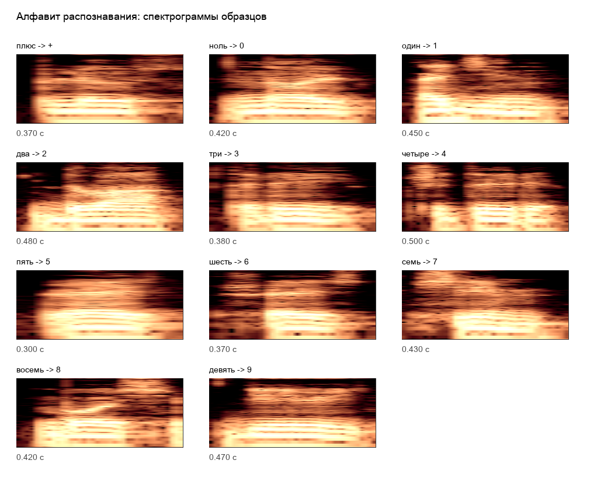
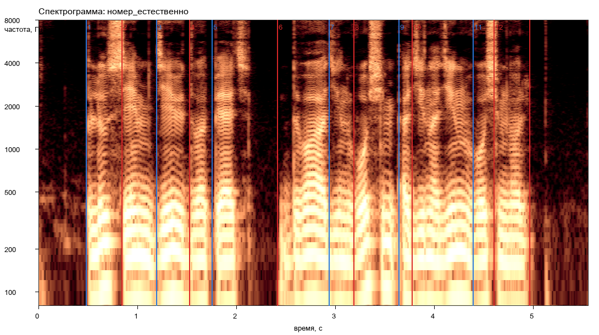
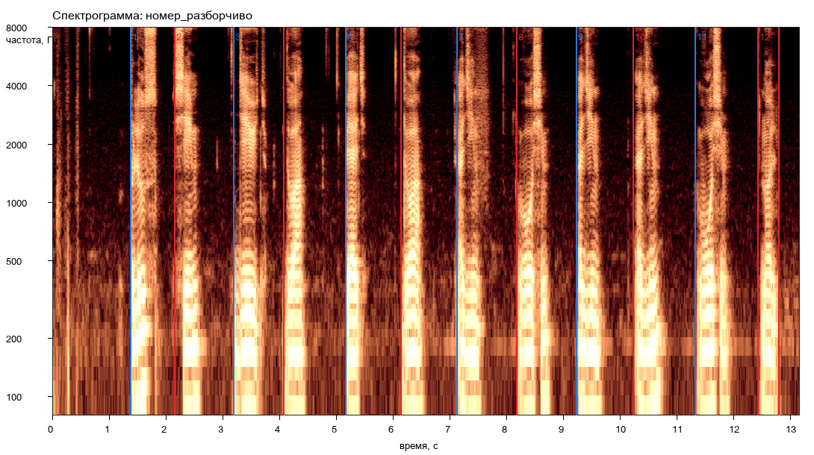
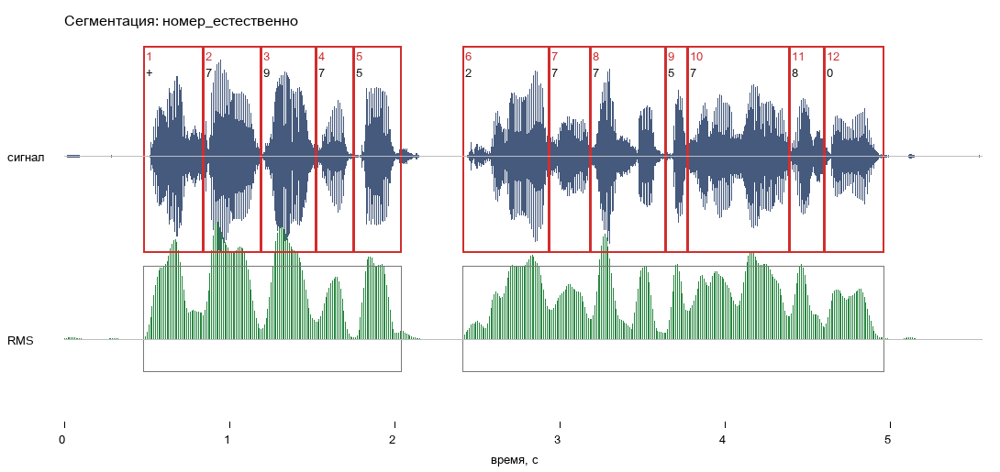
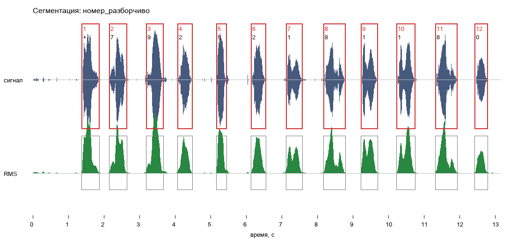
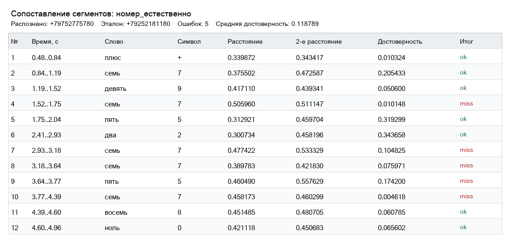
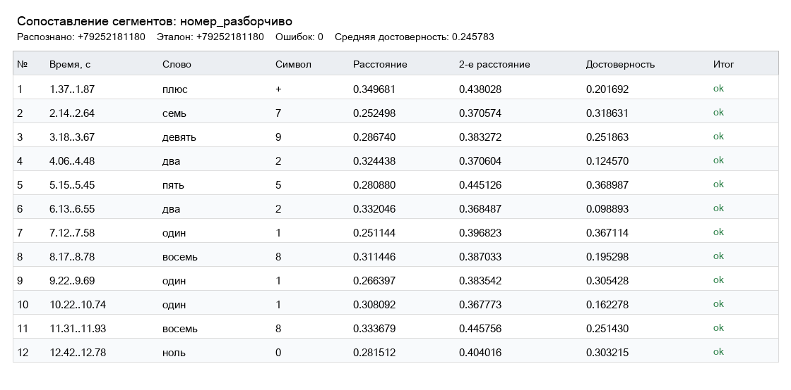

# Лабораторная работа №10

## Обработка голоса: анализатор речи


В работе реализован вариант 3: анализатор речи для телефонного номера. Используются 11 образцов слов из алфавита распознавания и две записи номера:

- `номер_естественно.wav` - номер произнесён слитно;
- `номер_разборчиво.wav` - номер произнесён разборчиво, с паузами.


## Исходные данные

Файлы находятся в `lab10/sounds`.

Алфавит распознавания:

| Слово | Символ |
| --- | --- |
| `плюс` | `+` |
| `ноль` | `0` |
| `один` | `1` |
| `два` | `2` |
| `три` | `3` |
| `четыре` | `4` |
| `пять` | `5` |
| `шесть` | `6` |
| `семь` | `7` |
| `восемь` | `8` |
| `девять` | `9` |

Ниже показаны спектрограммы всех образцов алфавита. Это нужно, чтобы было видно, с чем потом сравниваются сегменты номера.



Записи номера:

| Файл | Длительность, с | Частота, Гц | Каналов |
| --- | ---: | ---: | ---: |
| `номер_естественно.wav` | `5.553` | `48000` | `1` |
| `номер_разборчиво.wav` | `13.153` | `48000` | `1` |

## Теоретические сведения

**Спектрограмма** - это изображение спектра, где видно, как энергия сигнала распределяется по частотам во времени. В этой работе она нужна не просто как картинка, а как способ увидеть речевые фрагменты: паузы, гласные, шумные согласные и похожесть слов.

Для построения спектрограммы используется оконное преобразование Фурье:

```text
STFT{x[n]}(m, w) = X(m, w) = sum x[n] * window[n - m] * exp(-j*w*n)
```

Смысл простой: сигнал режется на короткие временные окна, и для каждого окна считается спектр. Потом эти спектры раскладываются по времени.

Спектрограмма считается как квадрат модуля спектра:

```text
spectrogram{x[n]} = |X(m, w)|^2
```

Окно Ханна:

```text
w(n) = 0.5 - 0.5 * cos(2*pi*n / (N - 1))
```

Оно используется здесь потому, что мягко зануляет края окна и уменьшает резкие скачки на границах фрагмента. Для речевого сигнала это важно: нам нужно смотреть локальный спектр слова, а не артефакты от грубой нарезки.

| Параметр | Значение |
| --- | ---: |
| Длина окна спектрограммы | `0.050` с |
| Шаг окна спектрограммы | `0.010` с |
| Окно | Ханна |

Для сегментации используется энергия коротких участков. Речевые участки имеют заметную энергию, а паузы и тишина - малую. В программе энергия считается как `RMS`:

```text
RMS = sqrt(mean(x^2))
```

По `RMS` находятся крупные речевые участки, а провалы энергии используются как кандидаты на границы между словами.


- речь - почти непрерывный звуковой поток, поэтому сегментировать её трудно;
- для распознавания удобно работать с заранее заданным набором слов;
- при распознавании важны темп, переходы между звуками и особенности произношения;
- результат полезно сопровождать оценкой достоверности.

Поэтому мы не распознаём произвольную речь, а работаем в активном режиме с маленьким словарём из 11 слов. Поэтому задача сводится к сегментации номера и сопоставлению каждого сегмента с заранее записанным образцом.

## Алгоритм
1. читает образцы слов и записи номера;
2. строит спектрограммы через оконное преобразование Фурье;
3. использует окно Ханна;
4. считает энергию `RMS` по коротким окнам;
5. выделяет речевые участки по энергии;
6. если участок длинный, дополнительно режет его по локальным провалам энергии;
7. строит спектральные признаки сегментов;
8. сопоставляет сегмент с каждым словом алфавита;
9. выбирает ближайший образец;
10. считает ошибки и достоверность.

## Спектрограммы

Параметры:

| Параметр | Значение |
| --- | --- |
| Окно | Ханна |
| Длина окна | `0.050` с |
| Шаг окна | `0.010` с |
| Шкала частот | логарифмическая |
| Диапазон отображения | примерно `80..8000` Гц |

Для сравнения построены обе версии номера.

Естественная запись:



Разборчивая запись:



## Сегментация

Естественная запись делится хуже: слова идут почти слитно, поэтому часть границ приходится искать внутри длинных речевых участков.



Разборчивая запись делится заметно лучше: найдены 12 отдельных речевых участков, по одному на каждый символ номера.



Границы сегментов сохранены в:

- `results/natural_segments.csv`;
- `results/clear_segments.csv`.

## Распознавание

Для сопоставления используется расстояние между последовательностями спектральных признаков. Чем меньше расстояние, тем ближе сегмент к образцу.

Достоверность считается по отрыву лучшего варианта от второго:

`confidence = (second_distance - best_distance) / second_distance`

Если лучший и второй варианты почти равны, достоверность низкая.

Визуальный разбор сопоставления для естественной записи:



Визуальный разбор сопоставления для разборчивой записи:



Результаты сопоставления сохранены в:

- `results/natural_matches.csv`;
- `results/clear_matches.csv`;
- `results/summary.json`.

## Численные результаты

Эталонная цепочка:

```text
+79252181180
```

В таблице ниже строка записана как обычная строка символов, то есть один начальный `+`:

| Запись | Сегментов | Распознано | Ошибок | Средняя достоверность |
| --- | ---: | --- | ---: | ---: |
| `номер_естественно` | `12` | `+79752775780` | `5` | `0.118789` |
| `номер_разборчиво` | `12` | `+79252181180` | `0` | `0.245783` |

## Что получилось хорошо

Главный плюс новой записи - сегментация. В `номер_разборчиво.wav` паузы между словами выражены явно, поэтому программа выделила ровно 12 сегментов без дробления слов пополам.

Для разборчивой записи это сразу дало правильное распознавание всего номера: `+79252181180`.

Также для обеих записей автоматически построены:

- спектрограммы;
- графики сегментации;
- таблицы сегментов;
- таблицы сопоставления;
- общий `summary.json`.

Распознавание естественной записи всё ещё слабое.

У разборчивой записи сегментация лучше, и в этом случае номер распознан без ошибок. Но средняя достоверность всё равно не очень высокая: лучший вариант часто отрывается от второго не слишком сильно.

Главные причины:

- на каждое слово есть только один образец;
- одно и то же слово в образце и в номере произносится по-разному;
- короткие слова похожи по спектру;
- алгоритм не использует правила номера, например что `+` бывает только в начале;
- алгоритм не знает языковой контекст, он сравнивает только акустику.

Устная речь не разбивается на идеальные куски сама по себе, а распознавание зависит не только от спектра, но и от темпа, переходов между звуками и контекста.

## Что можно улучшить

Записать несколько образцов каждого слова и сравнивать сегмент не с одним шаблоном, а с набором вариантов.

## Вывод

Цель работы была в том, чтобы реализовать простой анализатор речи для ограниченного алфавита слов телефонного номера: построить спектрограмму, выделить речевые сегменты, сопоставить их с записанными образцами и оценить качество распознавания. Для обеих записей построены спектрограммы, выполнена сегментация, получены цепочки символов, посчитаны ошибки и средняя достоверность.

Сравнение двух записей показало, что качество распознавания сильно зависит от разборчивости произношения и пауз между словами. В слитной записи `номер_естественно.wav` найдено 12 сегментов, но распознавание дало `5` ошибок. В разборчивой записи `номер_разборчиво.wav` паузы выражены лучше, поэтому сегменты выделились точнее, а номер распознан без ошибок.

Для анализатора с одним образцом на слово разборчивая запись подходит хорошо, а естественная слитная речь остаётся сложной из-за неявных границ между словами и вариативности произношения.
