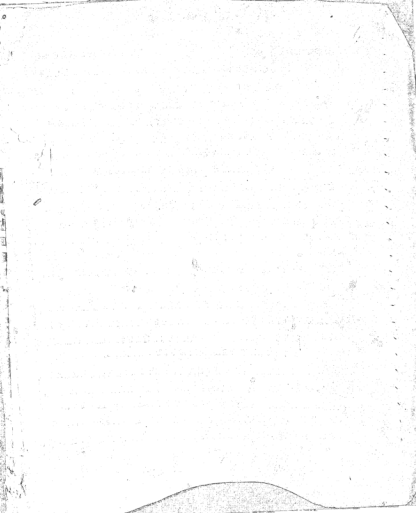
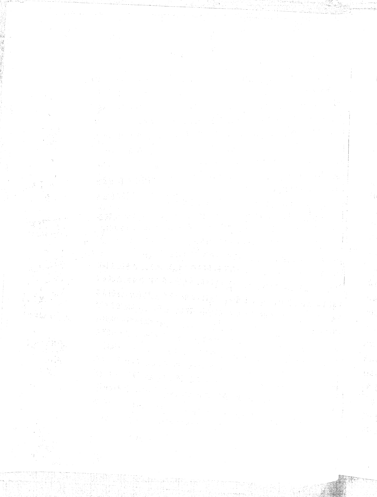
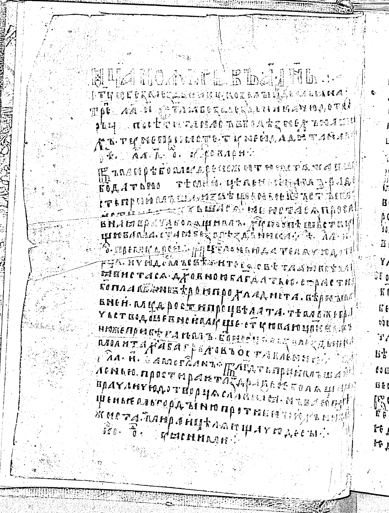
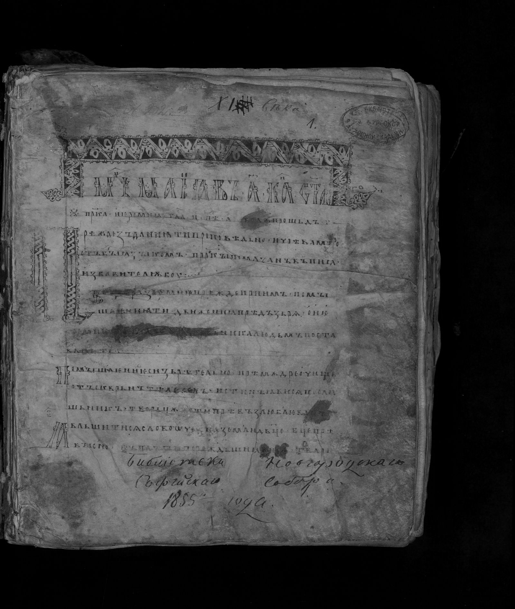
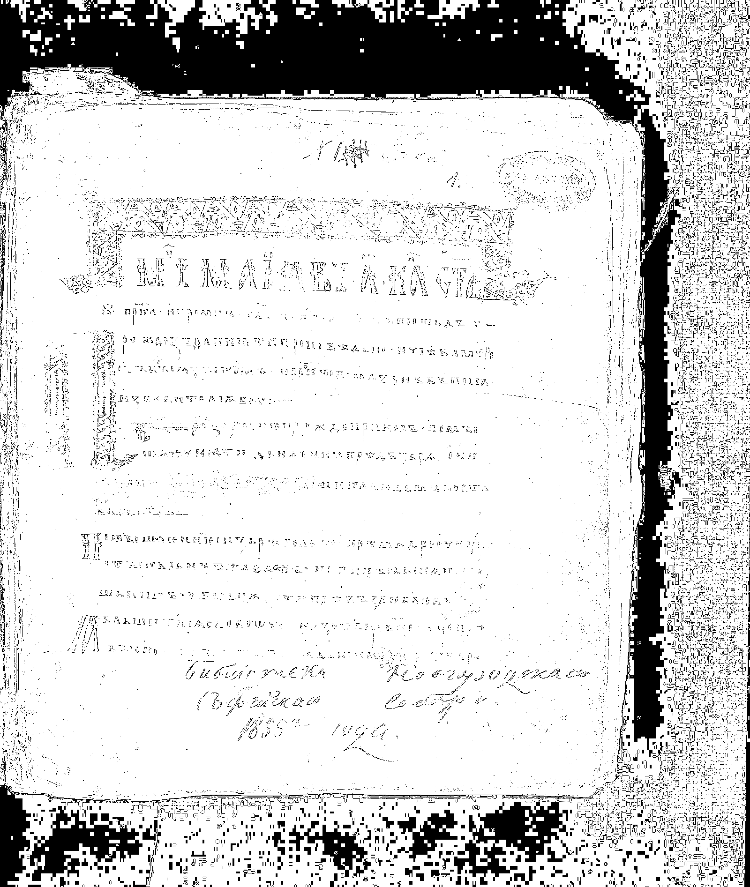
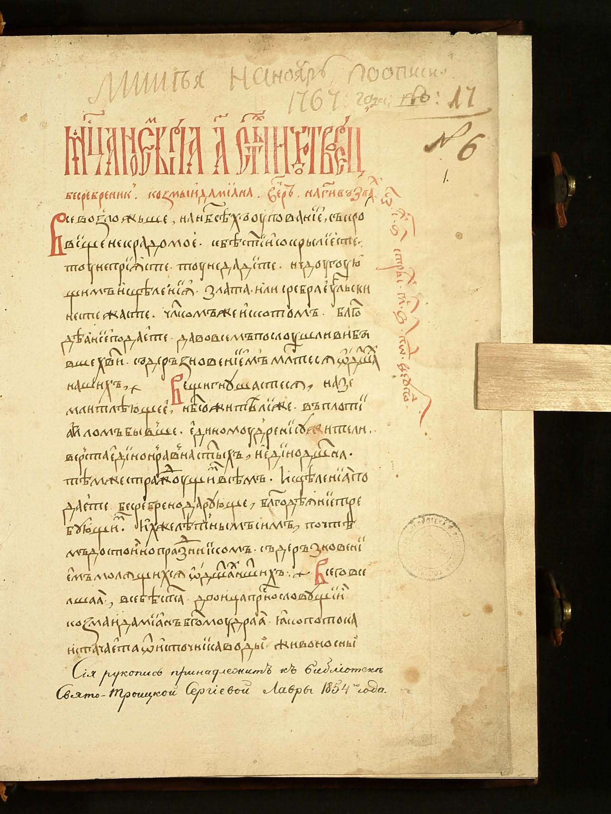
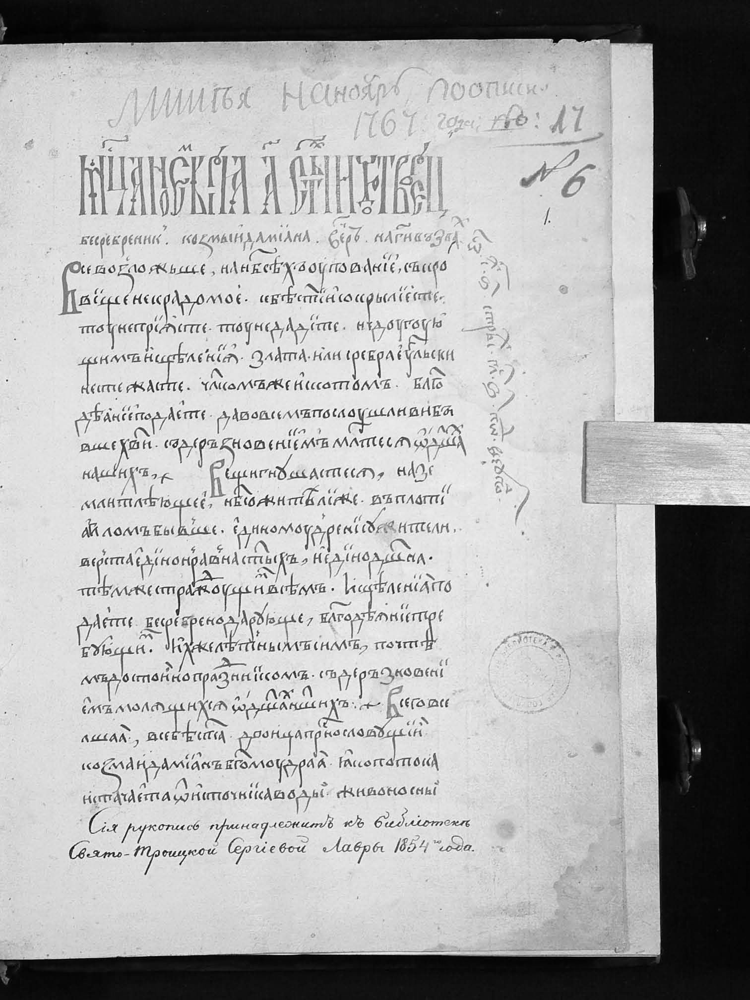
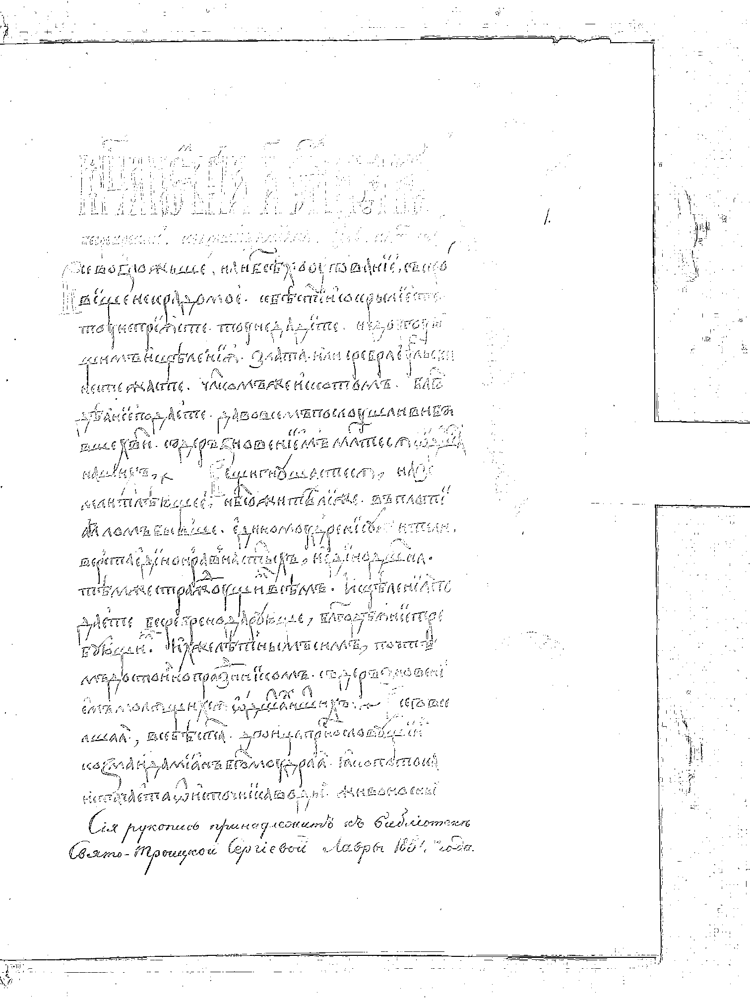

# Лабораторная работа №2

## Обесцвечивание и бинаризация растровых изображений

### Вариант

В соответствии с таблицей из задания вариант `7` соответствует методу адаптивной бинаризации `Сауволы`.

Для первого столбца таблицы указаны окна `3 x 3` и `25 x 25`, поэтому в работе показаны результаты бинаризации для обоих размеров окна.

### Цель работы

1. Привести полноцветные изображения к полутоновым без использования библиотечных функций обесцвечивания.
2. Выполнить бинаризацию полутоновых изображений методом Сауволы без использования библиотечных функций thresholding.
3. Показать результаты на всех 4 исходных изображениях, предоставленных для лабораторной работы.

### Исходные данные

- Исходные файлы:
  - `original_00.png` — `1877 x 2314`
  - `original_01.png` — `3000 x 3950`
  - `original_02.png` — `1600 x 1893`
  - `original_03.png` — `1512 x 2016`
- Основные параметры бинаризации:
  - `w = 3`
  - `w = 25`
  - `k = 0.2`
  - `R = 128`

### Теоретические сведения

#### 1. Приведение к полутону

Согласно лекции 2 для RGB-изображения яркость можно вычислять взвешенным усреднением каналов.

В работе использована формула `ITU-R BT.601`:

`Y = 0.299R + 0.587G + 0.114B`

Результат сохраняется как одноканальное полутоновое изображение.

#### 2. Метод Сауволы

Для каждого пикселя в окрестности `w x w` вычисляются:

- локальное среднее `m`
- локальное среднеквадратическое отклонение `s`

Порог определяется формулой:

`T = m * (1 + k * (s / R - 1))`

где:

- `k` — коэффициент чувствительности
- `R` — максимальное допустимое значение локального СКО

Решающее правило бинаризации:

- если `I(x, y) > T(x, y)`, пиксель становится белым
- иначе пиксель становится черным

#### 3. Ускорение вычислений

Чтобы считать локальные суммы по окнам быстро, в скрипте построены:

- интегральное изображение яркости
- интегральное изображение квадратов яркости

Это позволяет находить среднее и дисперсию в каждом окне без полного пересчета суммы по всем пикселям окна.

### Реализация

В рамках лр реализованы:

1. Загрузка цветного `RGB`-изображения.
2. Перевод в полутон по формуле `BT.601`.
3. Построение интегральных изображений.
4. Адаптивная бинаризация Сауволы для окон `3 x 3` и `25 x 25`.
5. Сохранение результатов для каждого исходного изображения.

Для каждого файла сохраняются:

- `00_source.png` — копия исходного изображения
- `01_grayscale.bmp` — полутоновое изображение в формате `BMP`
- `01_grayscale_preview.png` — PNG-превью полутонового результата для отчета
- `02_sauvola_w3.png` — бинаризация Сауволы при окне `3 x 3`
- `02_sauvola_w25.png` — бинаризация Сауволы при окне `25 x 25`
- `03_panel.png` — сводная панель для сравнения результатов

### Результаты

#### Изображение `original_00`

| Исходное изображение | Полутон `BT.601` |
| --- | --- |
|  |  |

| Саувола `3 x 3` | Саувола `25 x 25` |
| --- | --- |
|  |  |

Наблюдение: окно `3 x 3` оказалось слишком маленьким для такой старой и неравномерно освещенной страницы, поэтому текст почти пропадает. Окно `25 x 25` выделяет строки заметно лучше, хотя на фоне остается много шумовых артефактов.

#### Изображение `original_01`

| Исходное изображение | Полутон `BT.601` |
| --- | --- |
|  |  |

| Саувола `3 x 3` | Саувола `25 x 25` |
| --- | --- |
|  |  |

Наблюдение: для страницы с более контрастным письмом вариант `25 x 25` хорошо сохраняет основную структуру текста. Вариант `3 x 3` снова дает переосветленное бинарное изображение и теряет полезные детали.

#### Изображение `original_02`

| Исходное изображение | Полутон `BT.601` |
| --- | --- |
|  |  |

| Саувола `3 x 3` | Саувола `25 x 25` |
| --- | --- |
|  |  |

Наблюдение: на изображении с темным фоном и слабым текстом окно `25 x 25` позволяет отделить страницу от фона и частично восстановить надписи. Окно `3 x 3` выделяет крупные границы, но плохо передает сам текст.

#### Изображение `original_03`

| Исходное изображение | Полутон `BT.601` |
| --- | --- |
|  |  |

| Саувола `3 x 3` | Саувола `25 x 25` |
| --- | --- |
|  |  |

Наблюдение: это самое удачное изображение для метода Сауволы. При окне `25 x 25` хорошо читаются заголовок и основная часть текста, а окно `3 x 3` дает слишком слабый результат.

### Вывод

В лабораторной работе выполнены оба обязательных этапа:

1. Полноцветные изображения приведены к полутоновым вручную по формуле `BT.601`.
2. Полутоновые изображения бинаризованы методом Сауволы, соответствующим варианту `7`.

По результатам сравнения видно, что для предоставленных рукописных и старопечатных страниц окно `25 x 25` работает значительно лучше окна `3 x 3`. Малое окно слишком чувствительно к локальным перепадам яркости и практически не удерживает слабый текст, тогда как большее окно лучше учитывает фон страницы и позволяет выделить символы устойчивее.
