# Лабораторная работа №3

## Фильтрация изображений и морфологические операции

### Вариант

Для варианта `7` по таблице из задания нужен медианный фильтр для бинарного изображения с окном `3 x 3` и маской `холм`.

```text
1 2 1
2 4 2
1 2 1
```

Сумма весов в этой маске равна `16`, поэтому порог получается `9/16`.

### Что делается в работе

1. Берутся те же страницы, что использовались во второй лабораторной.
2. Для каждой страницы берется бинарный результат из лабы 2.
3. К этому бинарному изображению применяется фильтр варианта `7`.
4. Для наглядности строится `XOR`-разность между входом и результатом.

### Исходные данные

В работе использованы четыре изображения из лабы 2:

- `original_00.png`
- `original_01.png`
- `original_02.png`
- `original_03.png`

Так как вариант `7` относится именно к бинарной фильтрации, на вход фильтра подаются не цветные изображения напрямую, а бинарные результаты из лабы 2:

- `lab2/results/original_xx/02_sauvola_w25.png`

Я взял именно вариант `Сауволы 25 x 25`, потому что во второй лабораторной он давал самый внятный результат на всех четырех страницах.

### Теория

В лекции 3 медианный фильтр для бинарных изображений описан как локальное голосование по окрестности. Новый пиксель определяется по соседям.

В варианте `7` это голосование не обычное, а взвешенное: центральные точки влияют сильнее, чем крайние. Для окна `3 x 3` считается такая сумма:

`S = 1*b1 + 2*b2 + 1*b3 + 2*b4 + 4*b5 + 2*b6 + 1*b7 + 2*b8 + 1*b9`

где:

- `1` означает черный пиксель
- `0` означает белый пиксель

Дальше правило простое:

- если `S >= 9`, пиксель становится черным
- иначе пиксель становится белым

Такой фильтр хорошо убирает одиночные шумовые точки и мелкую бахрому, но не должен сильно ломать форму букв.

Разностное изображение по заданию строится через `XOR`:

- белый пиксель на разности означает, что значение изменилось
- черный пиксель означает, что пиксель остался прежним

### Сводка

| Изображение | Размер | Черных пикселей до | Черных пикселей после | Изменено пикселей | Доля изменений |
| --- | --- | --- | --- | --- | --- |
| `original_00` | `1877 x 2314` | `448429` | `383537` | `73838` | `1.70%` |
| `original_01` | `3000 x 3950` | `967612` | `916636` | `70230` | `0.59%` |
| `original_02` | `1600 x 1893` | `764557` | `735571` | `38298` | `1.26%` |
| `original_03` | `1512 x 2016` | `282586` | `276424` | `8148` | `0.27%` |

По этим числам видно, что фильтр работает аккуратно: он меняет не все подряд, а только локальные шумовые участки.

### Результаты

#### Изображение `original_00`

| Исходное цветное | Бинарный вход из лабы 2 |
| --- | --- |
|  | 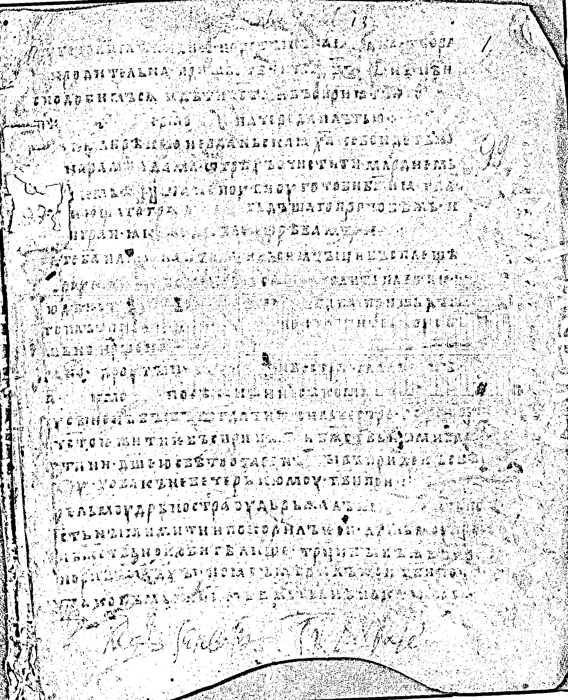 |

| После фильтра варианта `7` | `XOR`-разность |
| --- | --- |
| 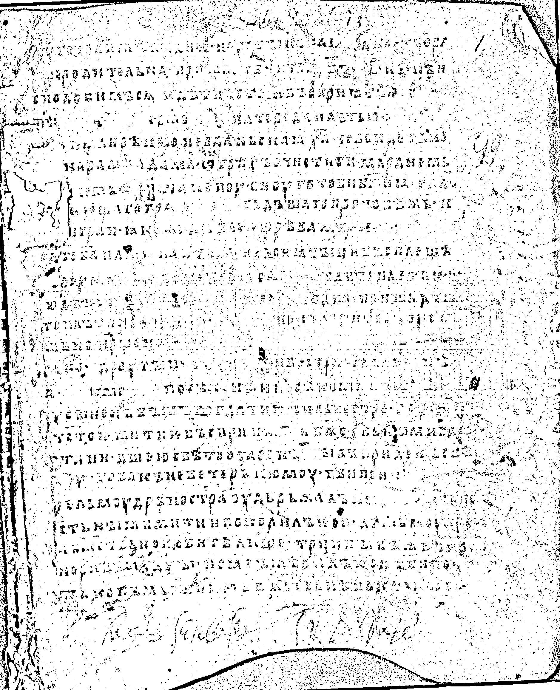 | 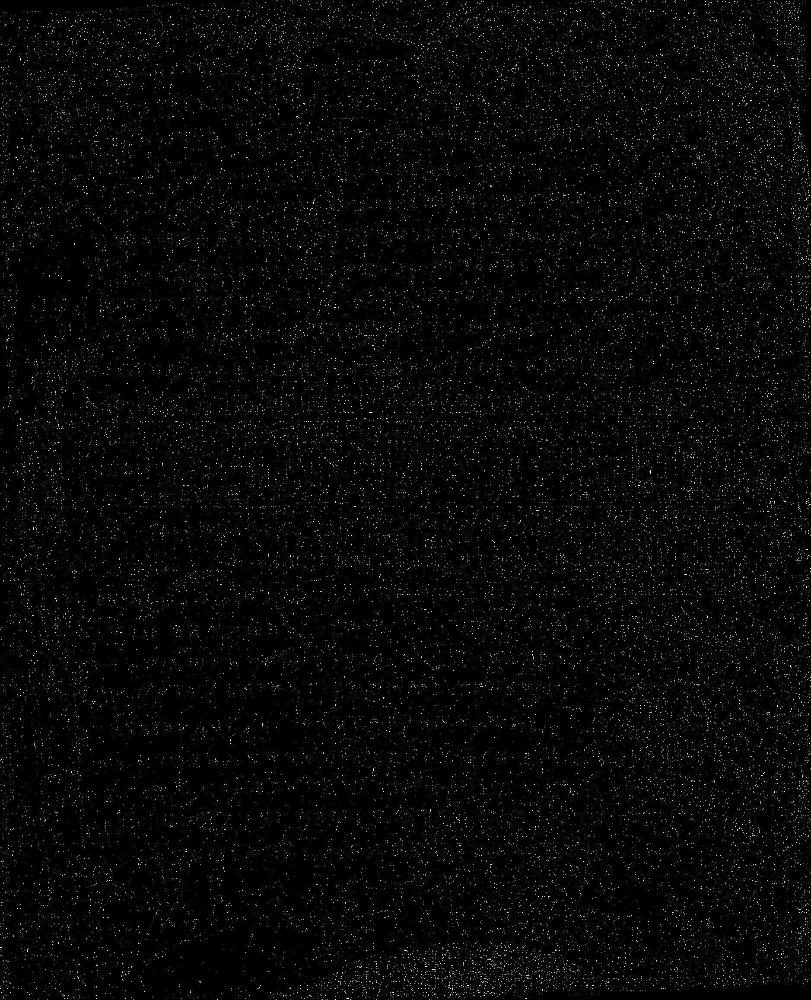 |

Здесь страница самая шумная. Фильтр неплохо убирает рассыпанные темные точки и немного сглаживает мелкую грязь вокруг штрихов. Крупне дефекты по краям страницы, понятно, остаются.

#### Изображение `original_01`

| Исходное цветное | Бинарный вход из лабы 2 |
| --- | --- |
|  |  |

| После фильтра варианта `7` | `XOR`-разность |
| --- | --- |
| 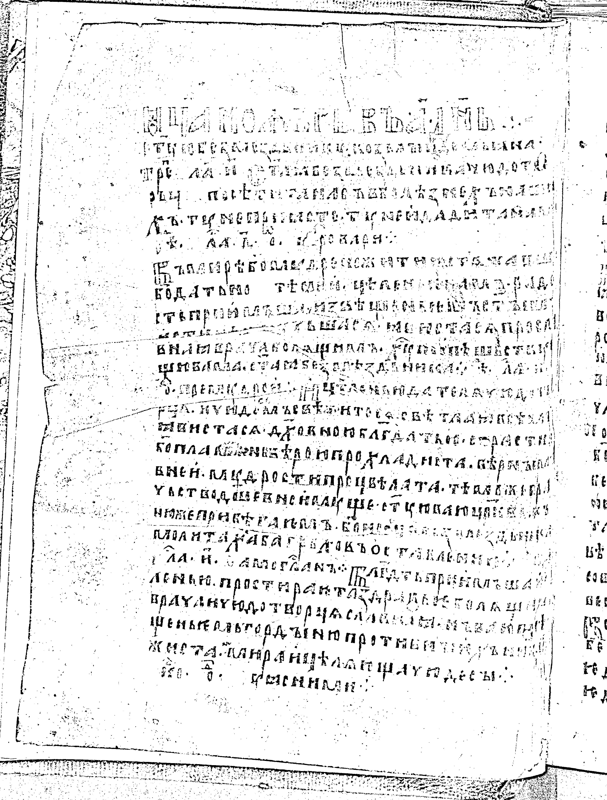 | 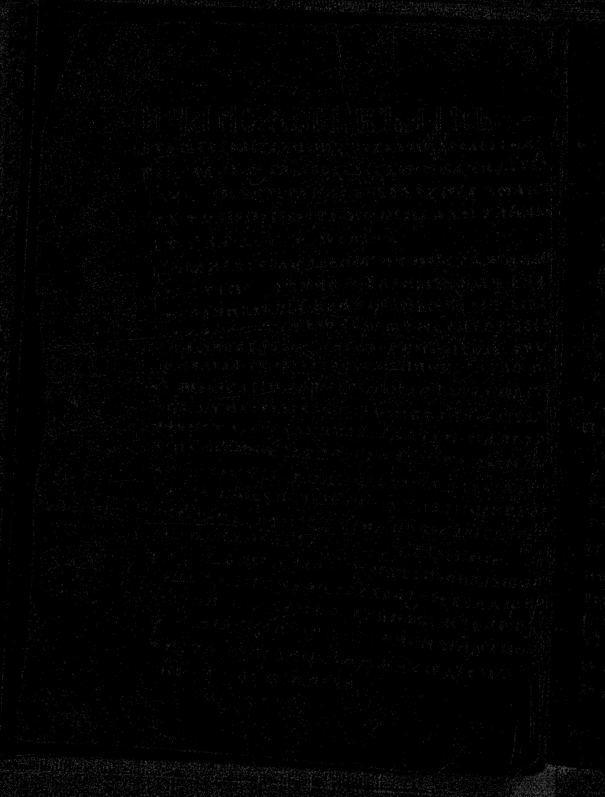 |

Тут вход уже сам по себе довольно чистый, поэтому правок мало. Фильтр в основном прибирает фоновые артефакты и почти не трогает буквы.

#### Изображение `original_02`

| Исходное цветное | Бинарный вход из лабы 2 |
| --- | --- |
| 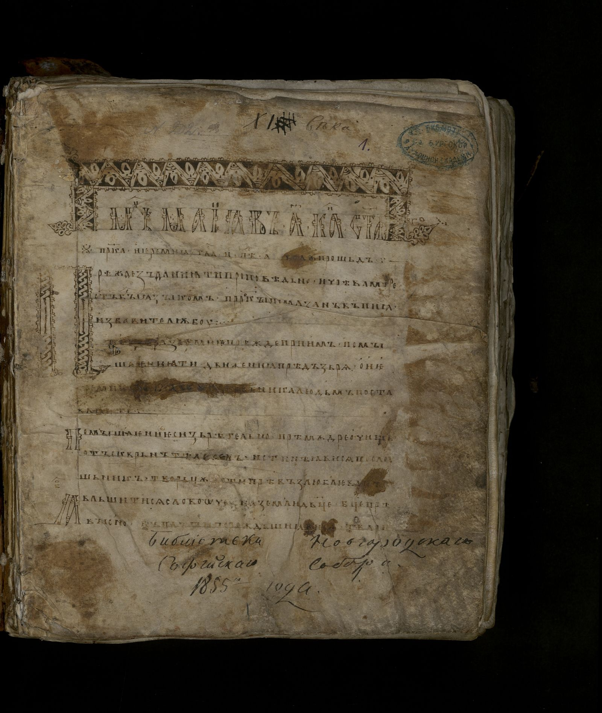 |  |

| После фильтра варианта `7` | `XOR`-разность |
| --- | --- |
| 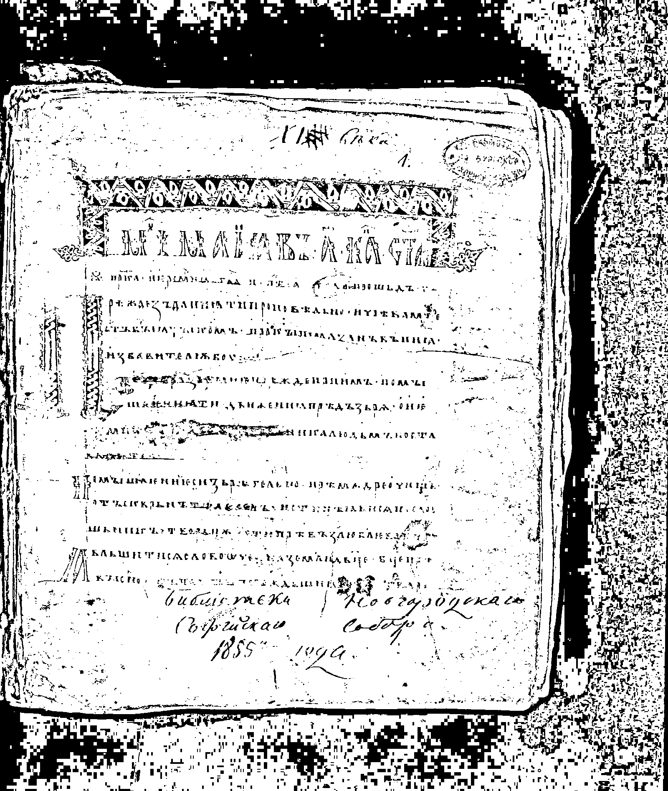 | 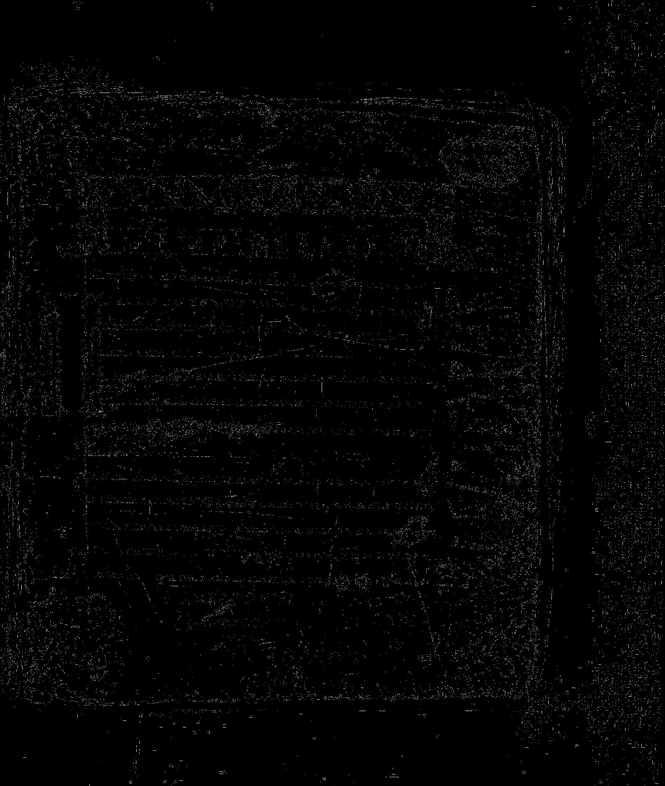 |

На этой странице фон тяжелее, поэтому фильтр заметнее прореживает мелкий шум. При этом крупные темные области, которые связаны уже с самим изображением страницы, никуда не деваются.

#### Изображение `original_03`

| Исходное цветное | Бинарный вход из лабы 2 |
| --- | --- |
|  | 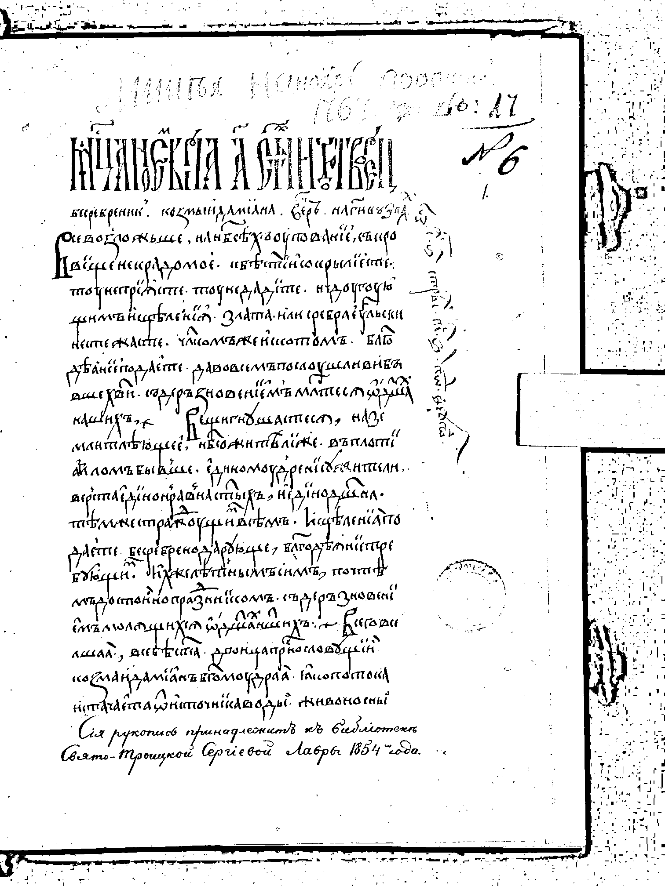 |

| После фильтра варианта `7` | `XOR`-разность |
| --- | --- |
| 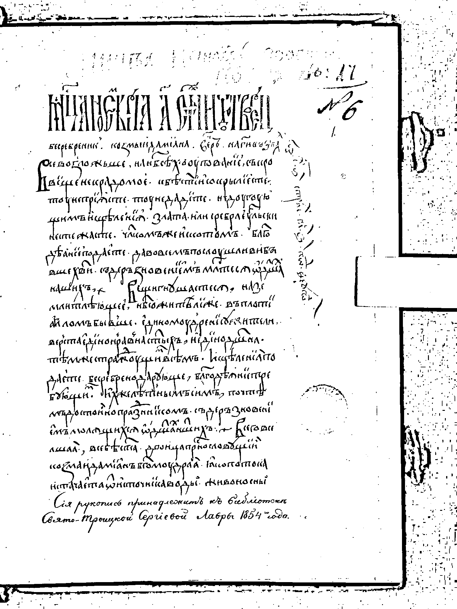 | 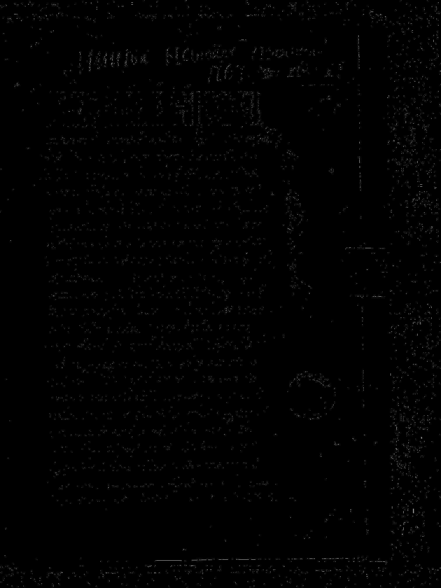 |

Это самый чистый вход из всех четырех, поэтому фильтр почти ничего не меняет. По `XOR` хорошо видно, что изменения очень локальные.

### Вывод

Для варианта `7` к бинарным изображениям применен медианный фильтр с маской `холм` и окном `3 x 3`. Для каждого изображения показан сам результат и `XOR`-разность, как требуется в задании.

По результату видно, что такой фильтр лучше всего подходит для мягкой чистки бинарного шума: одиночные точки и мелкая бахрома уходят, а текст в целом сохраняется. Большие фоновые искажения он не исправляет.
