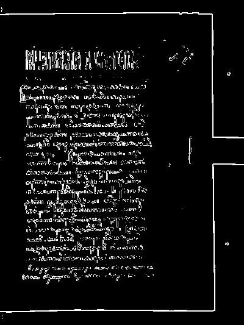

# Лабораторная работа №4

## Выделение контуров на изображении

### Вариант 7

Используется оператор Прюитт `3 x 3` и модуль градиента

`|∇f| = sqrt(Gx^2 + Gy^2)`

Маски из варианта:

```text
Gx =
[ +1   0  -1 ]
[ +1   0  -1 ]
[ +1   0  -1 ]

Gy =
[ +1  +1  +1 ]
[  0   0   0 ]
[ -1  -1  -1 ]
```

### Исходные данные

В работе использованы два изображения из папки `lab4`:

- цветное изображение — `palmer.jpg`, `1110 x 740`, формат `JPG`;
- текстовое изображение — `zhest.png`, `400 x 533`, формат `PNG`.

### Теоретические положения по лекции

Ниже перечислены все формулы и визуализации из лекции 4 («Выделение контуров»), которые использованы в данной работе, с указанием конкретных разделов лекции.

#### 1. Перевод в полутоновое (лекция, раздел 5.1)

Цветное изображение предварительно переводится в полутоновое по формуле `BT.601`:

`Y = 0.299R + 0.587G + 0.114B`

#### 2. Свёртка (лекция, раздел 2.1)

Отклик фильтра вычисляется как сумма произведений коэффициентов маски и значений пикселей в окне:

`R(x, y) = sum_i sum_j w(i, j) * f(x + i, y + j)`

В данной работе `w` — это маски Прюитт `Kx` и `Ky`:

`Gx = Kx * Y`

`Gy = Ky * Y`

где `*` обозначает операцию свёртки по окрестности `3 x 3`.

#### 3. Градиент и его модуль (лекция, раздел 2.2)

Градиент изображения:

`∇f(x, y) = (Gx, Gy)^T`

Модуль градиента (по варианту 7 — евклидова норма):

`|∇f| = sqrt(Gx^2 + Gy^2)`

#### 4. Направление градиента (лекция, раздел 2.2)

`alpha(x, y) = arctan(Gy / Gx)`

#### 5. Пороговое правило (лекция, раздел 2.3)

`f(x, y) = 255 * [|∇f| > T]`

Бинаризация выполняется по **исходному** (ненормализованному) модулю градиента. Нормализация нужна только для визуализации.

#### 6. Визуализация градиентов (лекция, раздел 2.4)

По условию задания для отображения строятся три обязательные матрицы:

- нормализованная матрица `Gx` в диапазоне `0..255`;
- нормализованная матрица `Gy` в диапазоне `0..255`;
- нормализованная матрица модуля `|∇f|` в диапазоне `0..255`.

Дополнительно по лекции в работе также построены:

- инвертированная матрица `G_inv = 255 - G_norm` (лекция, раздел 2.4);
- матрица направлений градиента (лекция, раздел 4).

#### 7. Нормализация (лекция, разделы 2.4 и 4)

Нормализация `Gx` и `Gy` выполняется по схеме min-max:

`A_norm = 255 * (A - A_min) / (A_max - A_min)`

Для модуля градиента в лекции используется запись

`G_norm = 255 * |∇f| / |∇f|_max`

В данной работе обе записи эквивалентны, так как для обоих изображений минимальное значение модуля градиента равно `0`.

#### 8. Нормализация матрицы направлений (лекция, раздел 4)

Область значений `arctan(Gy / Gx)` лежит в диапазоне `[-pi/2; +pi/2]` (лекция, раздел 4: «Область значений угла направления градиента берётся примерно в диапазоне [-pi/2, +pi/2]»).

Нормализация в `0..255` выполняется по лекционной формуле:

`alpha_norm = 255 * (alpha + pi) / (2 * pi)`

### Выбор порога

В лекции указано, что порог `T` можно брать как некоторую константу, например `1/12` от максимального значения градиента, или вычислять по критерию Отсу. Для практической части работы порог подбирался экспериментально по бинарной карте контуров.

Использовался следующий критерий: выбирался минимальный порог, при котором основные контуры объекта или символов остаются читаемыми и непрерывными, а слабый фоновый отклик уже заметно подавлен.

Подбор удобно выполнять по нормализованной матрице `G_norm` в шкале `0..255`, а затем переводить найденный уровень в реальный порог для исходного модуля `|∇f|`.

В результате были выбраны такие уровни:

- для `palmer.jpg` — `G_norm = 40`;
- для `zhest.png` — `G_norm = 50`.

Им соответствуют реальные пороги:

- `palmer`: `T = 40 / 255 * 721.61 = 113.19`;
- `zhest`: `T = 50 / 255 * 697.93 = 136.85`.

Проверка соседних уровней показывает, что выбранные значения лежат в переходной зоне между слишком плотной бинарной картой и уже слишком сильным прореживанием контуров.

Для `palmer.jpg`:

- `G_norm = 35` -> `43082` контурных пикселя (`5.24%`);
- `G_norm = 40` -> `34268` (`4.17%`);
- `G_norm = 45` -> `28055` (`3.42%`).

Для `zhest.png`:

- `G_norm = 40` -> `35670` контурных пикселей (`16.73%`);
- `G_norm = 50` -> `29852` (`14.00%`);
- `G_norm = 60` -> `24443` (`11.46%`).

Для сравнения, лекционная константа `|∇f|_max / 12` даёт более плотный отклик:

- `palmer`: `95828` пикселей (`11.67%`);
- `zhest`: `48971` пикселей (`22.97%`).

Также был рассчитан порог по критерию Отсу. Порог Отсу определялся по гистограмме нормализованной матрицы `G_norm`, после чего переводился в эквивалентный порог для исходного модуля `|∇f|`.

Полученные значения:

- `palmer`: `G_norm = 56`, то есть `T = 158.47`, итог `19516` контурных пикселей (`2.38%`);
- `zhest`: `G_norm = 46`, то есть `T = 125.90`, итог `32071` контурный пиксель (`15.04%`).

Сравнение с текущими выбранными порогами:

- для `palmer` критерий Отсу даёт более высокий порог, поэтому контурная карта получается заметно более разреженной; число компонент падает с `3241` до `1333`, но крупнейшая компонента уменьшается с `8137` до `2221`, то есть существенные контуры сильнее распадаются;
- для `zhest` критерий Отсу, наоборот, даёт более низкий порог, поэтому карта контуров становится намного плотнее: доля контурных пикселей растёт с `6.98%` до `15.04%`, а крупнейшая компонента увеличивается с `1444` до `3736`, что соответствует слиянию штрихов и усилению фонового отклика.

Таким образом, критерий Отсу был дополнительно проверен и действительно соответствует лекции как один из допустимых способов выбора `T`, однако для данных двух изображений экспериментально выбранные пороги лучше согласуются с визуальным требованием сохранить основные контуры без лишнего фона.

### Сравнение вариантов и итоговый выбор

В работе были проверены три способа выбора порога:

1. лекционная константа `|∇f|_max / 12`;
2. автоматический порог по критерию Отсу;
3. экспериментальный выбор по визуальной читаемости контуров.

Итоговое сравнение:

1. `|∇f|_max / 12` — `palmer`: `95828` пикселей (`11.67%`), `zhest`: `48971` пикселей (`22.97%`). Карта слишком плотная, остаётся много лишнего отклика.
2. Отсу — `palmer`: `19516` пикселей (`2.38%`), `zhest`: `32071` пиксель (`15.04%`). На одном изображении порог слишком высокий, на другом слишком низкий.
3. Экспериментальный — `palmer`: `34268` пикселей (`4.17%`), `zhest`: `29852` пикселя (`14.00%`). Лучше сохраняет основные контуры без чрезмерного фона.

Поэтому в итоговой версии работы принят экспериментальный выбор порога. Причины выбора именно этого варианта следующие:

1. он соответствует формулировке задания, где порог требуется подбирать опытным путём;
2. он не противоречит лекции, так как бинаризация всё равно выполняется по правилу `255 * [|∇f| > T]`;
3. по визуальному результату именно этот вариант даёт наиболее устойчивый компромисс между полнотой контуров и подавлением фона на обоих изображениях сразу.

Итоговая схема, на которой остановились:

- `Gx`, `Gy` и `|∇f|` вычисляются оператором Прюитт;
- порог выбирается экспериментально по `G_norm`;
- затем этот уровень переводится в эквивалентный порог `T` для исходного модуля `|∇f|`;
- бинарное контурное изображение строится по исходному `|∇f|`;
- инвертированная матрица и матрица направлений сохраняются как дополнительные результаты, соответствующие лекции.

### Выполнение

1. загрузка исходного `RGB`-изображения;
2. перевод изображения в полутоновое `BT.601`;
3. вычисление `Gx` и `Gy` оператором Прюитт `3 x 3`;
4. вычисление модуля градиента `|∇f| = sqrt(Gx^2 + Gy^2)`;
5. построение нормализованных матриц `Gx`, `Gy`, `|∇f|`;
6. построение инвертированной матрицы `G_inv`;
7. вычисление и нормализация матрицы направлений градиента;
8. выбор порога `T`;
9. построение бинарного контурного изображения по правилу `255 * [|∇f| > T]`;
10. сохранение результатов в `lab4/results`.

### Сохраняемые результаты

Обязательные по условию задания:

- `00_source.png` — исходное цветное изображение (условие, п. 1);
- `01_grayscale.png` — полутоновое изображение `BT.601` (условие, п. 2);
- `02_gx.png` — нормализованная матрица `Gx` (условие, п. 3);
- `03_gy.png` — нормализованная матрица `Gy` (условие, п. 3);
- `04_gradient.png` — нормализованная матрица `|∇f|` (условие, п. 3);
- `07_binary_gradient.png` — бинаризованное контурное изображение (условие, п. 4).

Дополнительные по лекции:

- `05_gradient_inverted.png` — инвертированная матрица `G_inv = 255 - G_norm` (лекция, раздел 2.4);
- `06_direction.png` — матрица направлений `α = arctan(Gy / Gx)` (лекция, раздел 4).

### Сводка

**Цветное изображение** (`palmer.jpg`, `1110 x 740`):

- `Gx`: `[-721.28; 708.33]`, `Gy`: `[-683.39; 695.29]`, `|∇f|`: `[0.00; 721.61]`
- уровень на `G_norm`: `40`, порог `T = 113.19`
- контурных пикселей: `34268` (`4.17%`)

**Текстовое изображение** (`zhest.png`, `400 x 533`):

- `Gx`: `[-519.49; 669.36]`, `Gy`: `[-667.28; 697.92]`, `|∇f|`: `[0.00; 697.93]`
- уровень на `G_norm`: `50`, порог `T = 136.85`
- контурных пикселей: `29852` (`14.00%`)

Для фотографического изображения оператор Прюитт выделяет основные контуры объекта при умеренном уровне шума. Для текстового изображения результат заметно хуже: оператор выделяет **контуры букв**, а не сами буквы, поэтому итоговая бинарная карта содержит значительное количество шума даже при разных значениях порога.

### Результаты

#### Цветное изображение

Исходное изображение:


Полутоновое изображение:


Нормализованная матрица `Gx`:


Нормализованная матрица `Gy`:


Нормализованная матрица `|∇f|`:


Инвертированная матрица `|∇f|`:


Матрица направлений градиента:


Бинаризованное контурное изображение при `G_norm = 40`, что соответствует `T = 113.19`:


На фотографическом изображении оператор Прюитт выделяет основные переходы яркости по границам объекта и фона. При выбранном пороге контур остаётся достаточно полным и при этом не переходит в слишком плотную шумовую карту.

#### Текстовое изображение

Исходное изображение:


Полутоновое изображение:


Нормализованная матрица `Gx`:


Нормализованная матрица `Gy`:


Нормализованная матрица `|∇f|`:


Инвертированная матрица `|∇f|`:


Матрица направлений градиента:


Бинаризованное контурное изображение при `G_norm = 50`, что соответствует `T = 136.85`:


Для сравнения — бинаризация при более высоком пороге `G_norm = 80` (`T = 218.96`, `14881` контурных пикселей, `6.98%`):



На текстовом изображении оператор Прюитт работает заметно хуже, чем на фотографическом. Контурный оператор выделяет **границы перепадов яркости**, а не сами символы, поэтому штрихи букв превращаются в двойные контуры — по одному на каждую сторону штриха. При низком пороге (`G_norm = 50`) текст читаем лучше, но появляется значительный шум. При высоком пороге (`G_norm = 80`) шум подавляется, но контуры букв становятся фрагментарными и текст теряет читаемость. Это ожидаемое ограничение простых градиентных операторов на изображениях с мелкими деталями.

### Вывод

В лабораторной работе №4 выполнено выделение контуров оператором Прюитт `3 x 3` в лекционной схеме градиентного анализа.

Для обоих изображений построены матрицы `Gx`, `Gy`, модуль градиента `|∇f|`, инвертированная матрица, матрица направлений и бинаризованное контурное изображение. Порогование выполнено по правилу `255 * [|∇f| > T]`, а выбор `T` проведён экспериментально с опорой на визуальную читаемость основных контуров.

Полученные результаты согласуются с лекцией: оператор Прюитт хорошо выделяет границы, матрица направлений позволяет анализировать ориентацию перепадов яркости, а изменение порога заметно влияет на плотность итоговой контурной карты.
