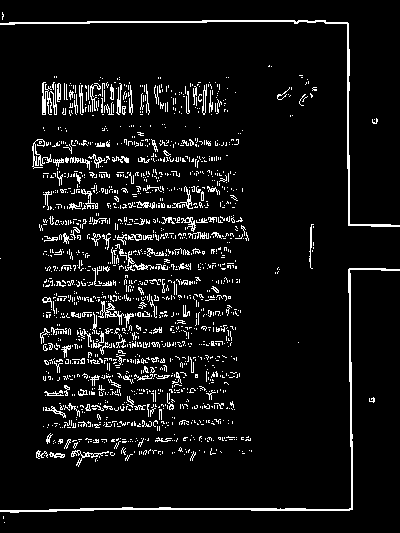

# Лабораторная работа №4

## Выделение контуров на изображении

### Вариант 7

Используется оператор Прюитта `3 x 3` и формула

`G = sqrt(Gx^2 + Gy^2)`

Маски из условия:

```text
Gx =
[ +1   0  -1 ]
[ +1   0  -1 ]
[ +1   0  -1 ]

Gy =
[ +1  +1  +1 ]
[  0   0   0 ]
[ -1  -1  -1 ]
```

### Исходные данные

В работе использованы два исходных изображения из папки `lab4`:

| Тип изображения | Файл | Размер | Формат |
| --- | --- | --- | --- |
| Цветное изображение | `palmer.jpg` | `1110 x 740` | `JPG` |
| Текстовое изображение | `zhest.png` | `400 x 533` | `PNG` |


### Теория

Границы для полутонового изображения выделяются через градиент яркости. Сначала цветное изображение переводится в полутоновое, после чего к нему применяется маска оператора.

В работе полутон строится по формуле `BT.601`:

`Y = 0.299R + 0.587G + 0.114B`

Далее вычисляются две производные:

`Gx = Kx * Y`

`Gy = Ky * Y`

где `Kx` и `Ky` — маски Прюитта, а `*` — свертка по окрестности `3 x 3`.

Итоговый модуль градиента считается:

`G = sqrt(Gx^2 + Gy^2)`

Так как `Gx` и `Gy` содержат как отрицательные, так и положительные значения, для отображения в отчете они нормализуются в диапазон `0..255`:

`A_norm = 255 * (A - A_min) / (A_max - A_min)`

Нормализация нужна только для визуализации матриц `Gx`, `Gy` и `G`.

Бинаризация выполняется по самому модулю градиента `G`:

- если `G > T`, пиксель считается контуром и получает значение `255`;
- иначе пиксель получает значение `0`.

Порог можно подбирать как константу от максимального градиента или выбирать экспериментально. В этой работе порог подобран опытным путем для каждого изображения отдельно после нескольких пробных запусков скрипта.

### Исправления с учетом материалов лекции

После повторной проверки лекции было уточнено, что в работе нужно различать две разные операции:

1. Нормализация `Gx`, `Gy`, `G` в диапазон `0..255` нужна только для отображения результатов в отчете.
2. Бинаризация должна выполняться по исходному модулю градиента `G`, а не по нормализованной картинке `G_norm`.

В первой версии решения порог по ошибке применялся к нормализованной матрице `G_norm`.

Правильно:

`binary = 255, если G > T`

Неправильно:

`binary = 255, если G_norm > T`

После исправления порогование выполняется по вещественной матрице градиента до округления и до перевода в `uint8`.

### Выполнение
1. загрузка исходного `RGB`-изображения;
2. перевод в полутоновое `BT.601`;
3. собственная свертка с масками Прюитта `3 x 3`;
4. вычисление `G = sqrt(Gx^2 + Gy^2)`;
5. нормализация `Gx`, `Gy`, `G` в диапазон `0..255`;
6. бинаризация модуля `G` по подобранному порогу до этапа визуализационной нормализации;
7. сохранение всех результатов в `lab4/results`.

Для каждого изображения сохраняются:

- `00_source.png` — исходное цветное изображение;
- `01_grayscale.png` — полутоновое изображение;
- `02_gx.png` — нормализованная матрица `Gx`;
- `03_gy.png` — нормализованная матрица `Gy`;
- `04_gradient.png` — нормализованная матрица `G`;
- `05_binary_gradient.png` — бинаризованная матрица `G`.

### Сводка

| Изображение | Размер | `Gx` диапазон | `Gy` диапазон | `G` диапазон | Порог `T` | Контурных пикселей | Доля контуров |
| --- | --- | --- | --- | --- | --- | --- | --- |
| Цветное изображение | `1110 x 740` | `[-721.28; 708.33]` | `[-683.39; 695.29]` | `[0.00; 721.61]` | `113.19` | `34269` | `4.17%` |
| Текстовое изображение | `400 x 533` | `[-519.49; 669.36]` | `[-667.28; 697.92]` | `[0.00; 697.93]` | `218.96` | `14881` | `6.98%` |

Для цветного изображения нужен более мягкий порог, иначе заметные контуры объекта становятся слишком редкими. Для текстового изображения порог взят выше, потому что на нем сильных локальных перепадов яркости больше и при меньшем `T` появляется лишний фоновый отклик.

### Результаты

#### Цветное изображение

Исходное цветное изображение:


Полутоновое изображение `BT.601`:


Нормализованная матрица `Gx`:


Нормализованная матрица `Gy`:


Нормализованная матрица `G = sqrt(Gx^2 + Gy^2)`:


Бинаризация `G` при `T = 113.19`:


На цветном изображении оператор Прюитта уверенно выделяет основные переходы яркости по границам объекта и фона. После бинаризации при `T = 113.19` сохраняются основные контуры без чрезмерного распада на мелкий шум.

#### Текстовое изображение

Исходное цветное изображение:


Полутоновое изображение `BT.601`:


Нормализованная матрица `Gx`:


Нормализованная матрица `Gy`:


Нормализованная матрица `G = sqrt(Gx^2 + Gy^2)`:


Бинаризация `G` при `T = 218.96`:



Для текстового изображения контуры символов, штрихов и границ между текстом и фоном выражены достаточно сильно, поэтому итоговый порог выбран выше. При `T = 218.96` остаются главные контурные линии, а слабые фоновые отклики заметно подавляются.

### Вывод

В лабораторной работе №4 выполнено выделение контуров с помощью оператора Прюитта `3 x 3` и формулы `G = sqrt(Gx^2 + Gy^2)`.

Для обоих изображений из папки `lab4` построены все результаты, требуемые заданием: исходное цветное изображение, полутоновое изображение, нормализованные матрицы `Gx`, `Gy`, `G` и бинаризованный результат по подобранному порогу.

По результатам видно, что оператор Прюитта хорошо выделяет главные переходы яркости, но качество бинарного контура заметно зависит от порога: слишком маленький порог оставляет лишний шум, а слишком большой удаляет полезные границы.
