# Лабораторная работа №4

## Выделение контуров на изображении

### Вариант 7

Используется оператор Прюитта `3 x 3` и формула

`G = sqrt(Gx^2 + Gy^2)`

Маски из условия:

```text
Gx =
[ +1   0  -1 ]
[ +1   0  -1 ]
[ +1   0  -1 ]

Gy =
[ +1  +1  +1 ]
[  0   0   0 ]
[ -1  -1  -1 ]
```

### Исходные данные

В работе использованы два исходных изображения из папки `lab4`:

| Тип изображения | Файл | Размер | Формат |
| --- | --- | --- | --- |
| Цветное изображение | `palmer.jpg` | `1110 x 740` | `JPG` |
| Текстовое изображение | `zhest.png` | `400 x 533` | `PNG` |


### Теория

Границы для полутонового изображения выделяются через градиент яркости. Сначала цветное изображение переводится в полутоновое, после чего к нему применяется маска оператора.

В работе полутон строится по формуле `BT.601`:

`Y = 0.299R + 0.587G + 0.114B`

Далее вычисляются две производные:

`Gx = Kx * Y`

`Gy = Ky * Y`

где `Kx` и `Ky` — маски Прюитта, а `*` — свертка по окрестности `3 x 3`.

Итоговый модуль градиента считается:

`G = sqrt(Gx^2 + Gy^2)`

Так как `Gx` и `Gy` содержат как отрицательные, так и положительные значения, для отображения в отчете они нормализуются в диапазон `0..255`:

`A_norm = 255 * (A - A_min) / (A_max - A_min)`

Нормализация нужна только для визуализации матриц `Gx`, `Gy` и `G`.

Для наглядности дополнительно строятся:

- инвертированная матрица модуля градиента `G_inv = 255 - G_norm`;
- матрица направлений градиента `alpha`, где угол вычисляется по формуле `alpha = arctan(Gy / Gx)`.

В реализации для устойчивости вычислений используется форма `arctan2(Gy, Gx)`, эквивалентная этой записи по смыслу и удобная при `Gx = 0`.

Нормализованная матрица направлений строится по формуле:

`alpha_norm = 255 * (alpha + pi) / (2pi)`

Бинаризация выполняется по самому модулю градиента `G`, а порог берется по лекции как доля от максимального значения:

`T = G_max / 12`

После этого применяется правило:

- если `G > T`, пиксель считается контуром и получает значение `255`;
- иначе пиксель получает значение `0`.

### Исправления с учетом материалов лекции

После повторной проверки лекции в работу внесены три принципиальных уточнения:

1. Нормализация `Gx`, `Gy`, `G` в диапазон `0..255` нужна только для отображения результатов в отчете.
2. Порог бинаризации должен задаваться по лекционной формуле `T = G_max / 12`, а не подбираться вручную.
3. В набор результатов нужно включать не только `Gx`, `Gy`, `G`, но и инвертированную матрицу градиента и матрицу направлений.

После исправления бинаризация выполняется по вещественной матрице градиента `G` до округления и до перевода в `uint8`, а значение `T` автоматически вычисляется для каждого изображения по одному и тому же правилу.

### Выполнение
1. загрузка исходного `RGB`-изображения;
2. перевод в полутоновое `BT.601`;
3. собственная свертка с масками Прюитта `3 x 3`;
4. вычисление `G = sqrt(Gx^2 + Gy^2)`;
5. нормализация `Gx`, `Gy`, `G` в диапазон `0..255`;
6. построение инвертированной матрицы `G_inv = 255 - G_norm`;
7. вычисление матрицы направлений `alpha` и ее нормализация;
8. вычисление порога `T = G_max / 12`;
9. бинаризация модуля `G` по найденному порогу;
10. сохранение всех результатов в `lab4/results`.

Для каждого изображения сохраняются:

- `00_source.png` — исходное цветное изображение;
- `01_grayscale.png` — полутоновое изображение;
- `02_gx.png` — нормализованная матрица `Gx`;
- `03_gy.png` — нормализованная матрица `Gy`;
- `04_gradient.png` — нормализованная матрица `G`;
- `05_gradient_inverted.png` — инвертированная матрица `G`;
- `06_direction.png` — нормализованная матрица направлений градиента;
- `07_binary_gradient.png` — бинаризованная матрица `G`.

### Сводка

| Изображение | Размер | `Gx` диапазон | `Gy` диапазон | `G` диапазон | Правило порога | Порог `T` | Контурных пикселей | Доля контуров |
| --- | --- | --- | --- | --- | --- | --- | --- | --- |
| Цветное изображение | `1110 x 740` | `[-721.28; 708.33]` | `[-683.39; 695.29]` | `[0.00; 721.61]` | `G_max / 12` | `60.13` | `95828` | `11.67%` |
| Текстовое изображение | `400 x 533` | `[-519.49; 669.36]` | `[-667.28; 697.92]` | `[0.00; 697.93]` | `G_max / 12` | `58.16` | `48971` | `22.97%` |

Так как в обоих случаях используется одно и то же правило `T = G_max / 12`, значения порога оказываются близкими друг к другу и определяются только максимальным модулем градиента конкретного изображения. На текстовом изображении доля контурных пикселей заметно выше, потому что штрихи и границы букв дают большое количество резких локальных перепадов яркости.

### Результаты

#### Цветное изображение

Исходное цветное изображение:


Полутоновое изображение `BT.601`:


Нормализованная матрица `Gx`:

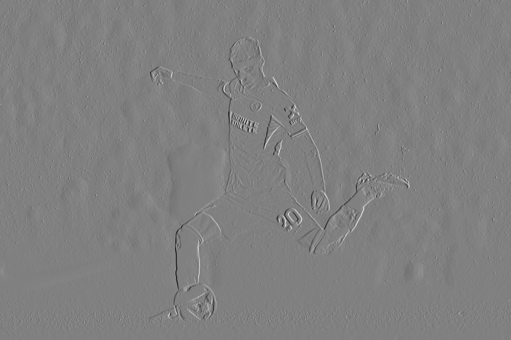

Нормализованная матрица `Gy`:

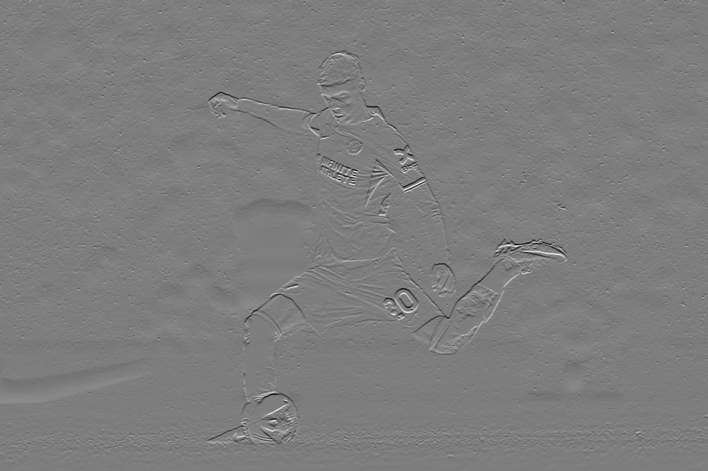

Нормализованная матрица `G = sqrt(Gx^2 + Gy^2)`:

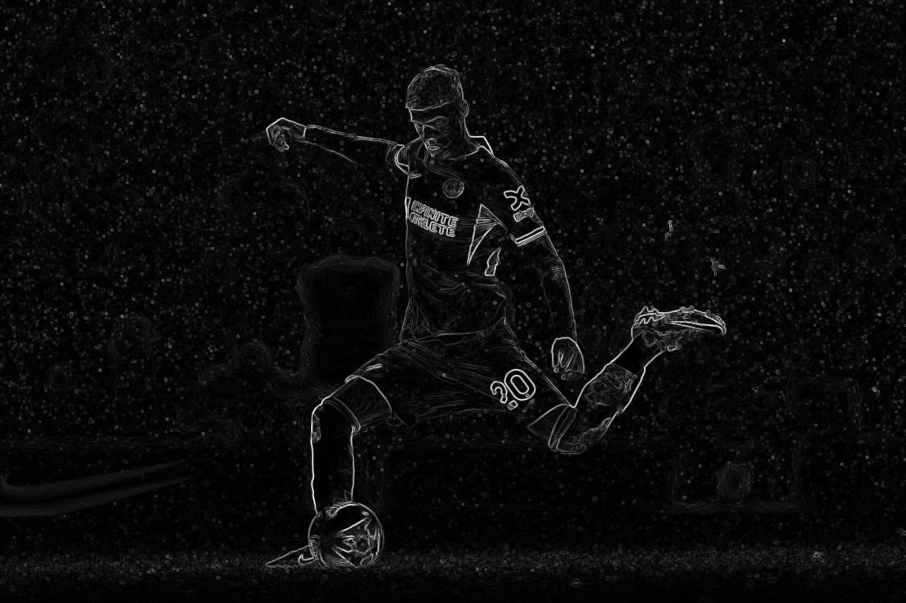

Инвертированная матрица `G`:

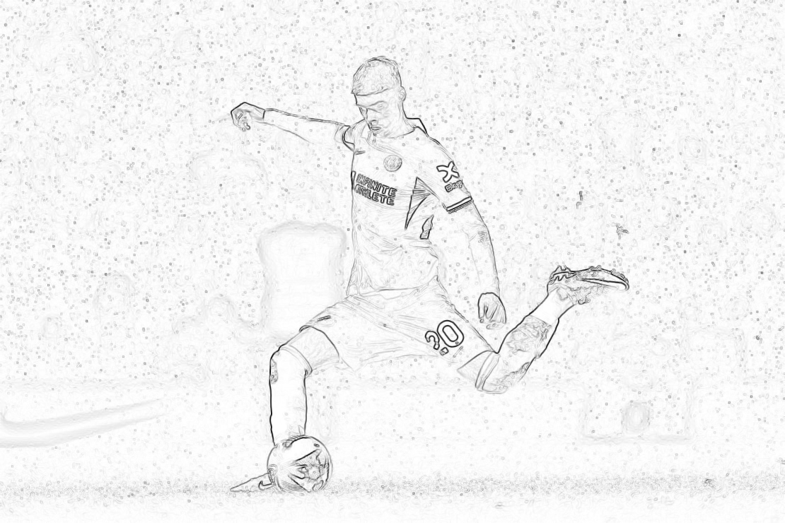

Матрица направлений градиента:

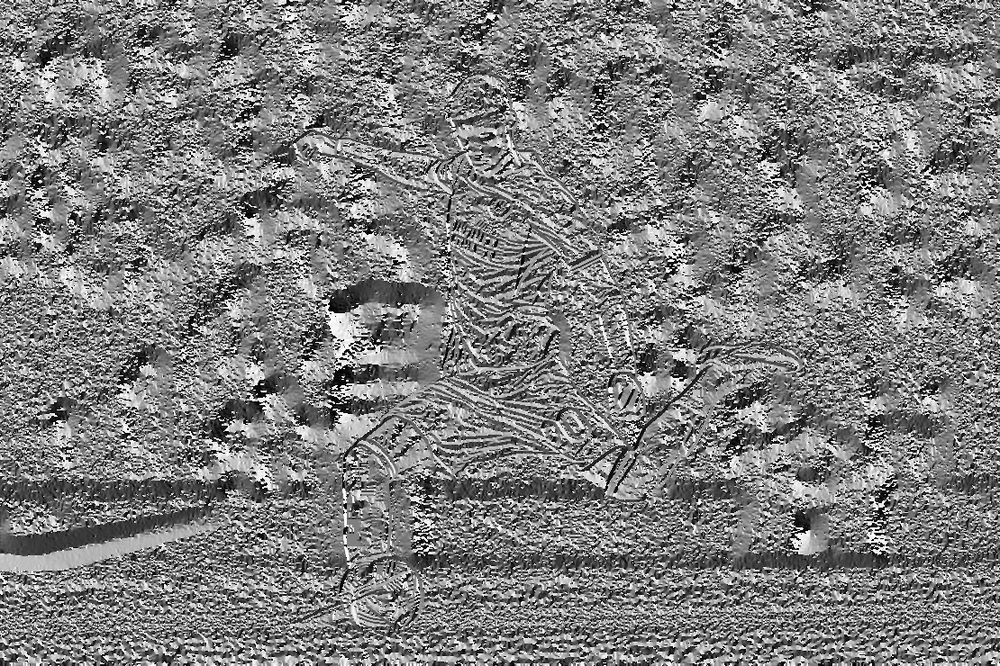

Бинаризация `G` при `T = G_max / 12 = 60.13`:

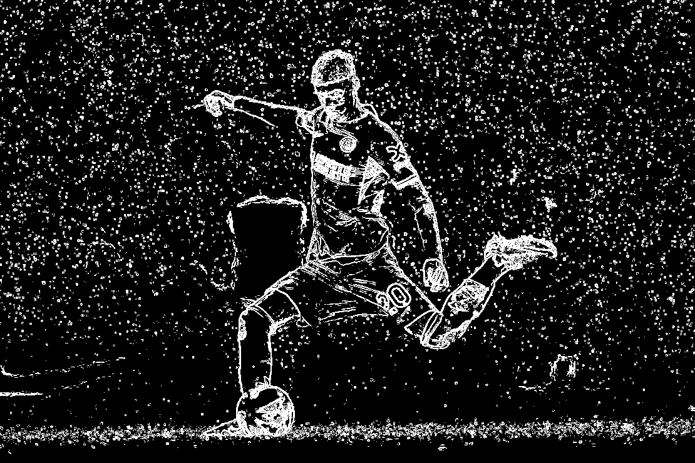

На цветном изображении оператор Прюитта уверенно выделяет основные переходы яркости по границам объекта и фона. При лекционном пороге `T = G_max / 12` контур получается плотнее, чем в версии с ручной настройкой, и сохраняет больше слабых границ.

#### Текстовое изображение

Исходное цветное изображение:

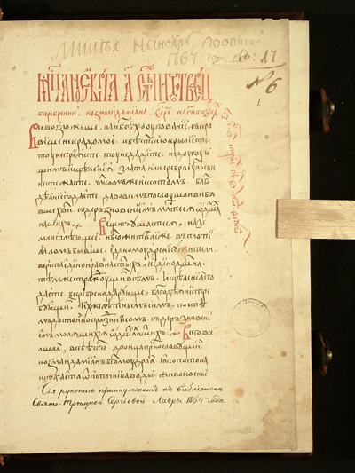

Полутоновое изображение `BT.601`:

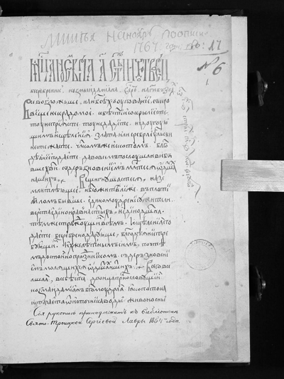

Нормализованная матрица `Gx`:

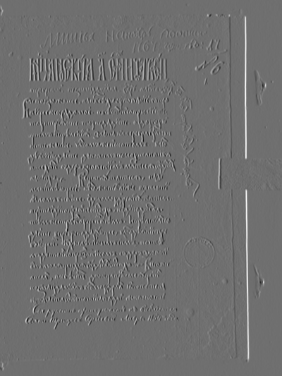

Нормализованная матрица `Gy`:

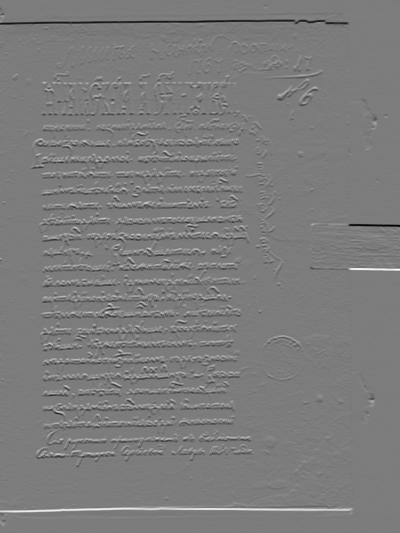

Нормализованная матрица `G = sqrt(Gx^2 + Gy^2)`:

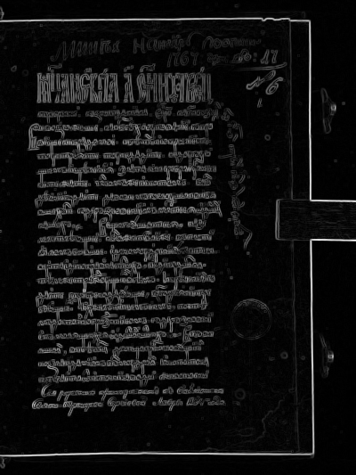

Инвертированная матрица `G`:

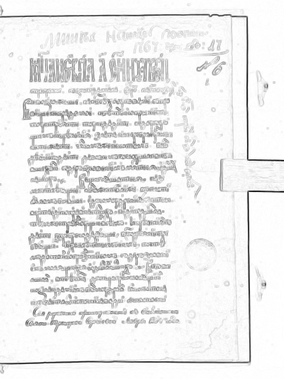

Матрица направлений градиента:

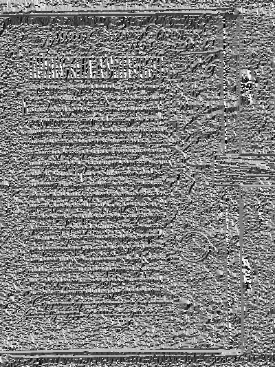

Бинаризация `G` при `T = G_max / 12 = 58.16`:

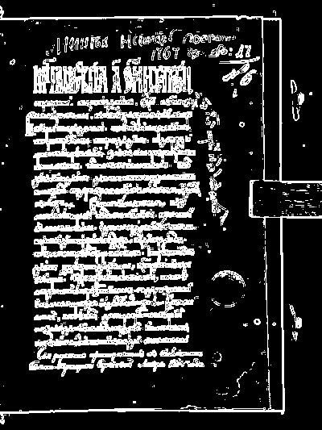

Для текстового изображения штрихи символов создают большое число сильных локальных перепадов яркости, поэтому при том же правиле `T = G_max / 12` итоговая бинарная карта содержит заметно больше контурных пикселей, чем на цветном изображении.

### Вывод

В лабораторной работе №4 выполнено выделение контуров с помощью оператора Прюитта `3 x 3` и формулы `G = sqrt(Gx^2 + Gy^2)`.

Для обоих изображений из папки `lab4` построены основные результаты градиентного метода из лекции: исходное цветное изображение, полутоновое изображение, нормализованные матрицы `Gx`, `Gy`, `G`, инвертированная матрица, матрица направлений градиента и бинаризованный результат.

После исправления работа соответствует лекционной схеме: бинаризация выполняется по исходному модулю градиента, а порог выбирается автоматически как `G_max / 12`. По результатам видно, что оператор Прюитта хорошо выделяет границы, а одинаковое правило выбора порога позволяет обрабатывать разные изображения без ручной подстройки.
