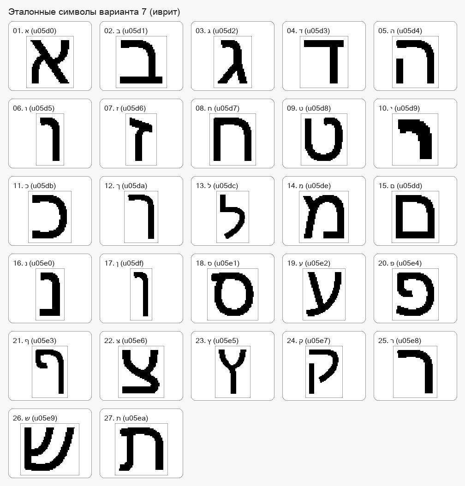
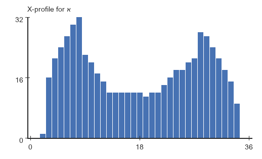
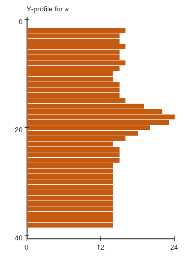
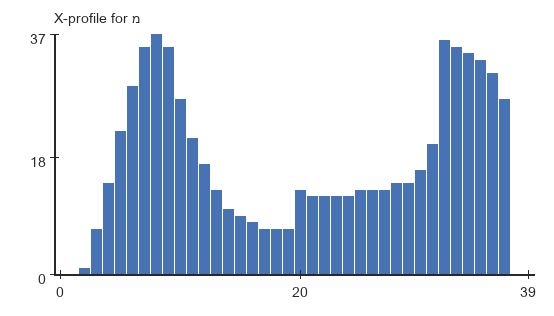
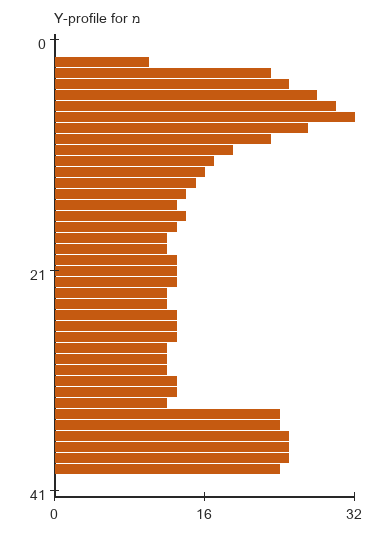
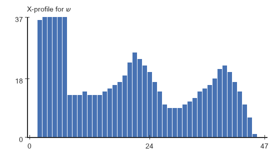
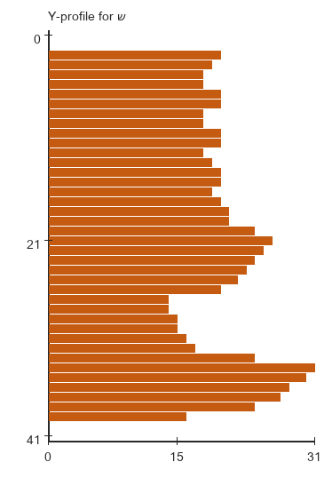
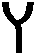
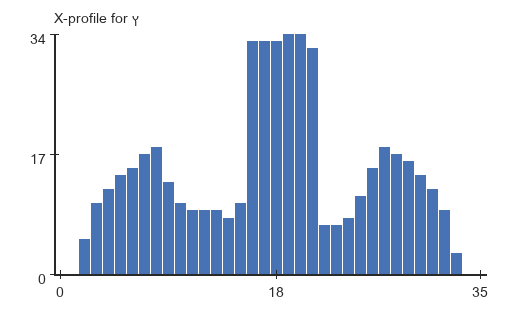
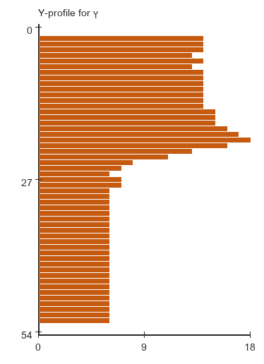

# Лабораторная работа №5

## Выделение признаков символов

### Вариант 7

Для варианта `7` по таблице задания выбран **иврит**:

`א ב ג ד ה ו ז ח ט י כ ך ל מ ם נ ן ס ע פ ף צ ץ ק ר ש ת`

Всего сгенерировано `27` эталонных изображений символов.

### Что сделано в работе

1. Сгенерированы эталонные изображения всех символов выбранного алфавита.
2. Белые поля автоматически обрезаны.
3. Каждый символ сохранен по принципу `1 символ = 1 файл`.
4. Для каждого изображения вычислены все признаки из задания.
5. Скалярные признаки сохранены в `CSV` с разделителем `;`.
6. Профили `X` и `Y` сохранены в `PNG` в виде столбчатых диаграмм.

### Исходные данные

| Параметр | Значение |
| --- | --- |
| Алфавит | Иврит |
| Шрифт | `Arial Unicode.ttf` |
| Размер шрифта | `72` |
| Количество символов | `27` |
| Папка эталонов | `lab5/source_symbols` |
| Папка результатов | `lab5/results` |
| Скалярные признаки | `lab5/results/summary.csv` |

### Теория

В работе используется бинарная функция:

`f(x, y) ∊ {0, 1}`

где:

- `1` соответствует чёрному пикселю символа;
- `0` соответствует белому фону.

#### 1. Вес и удельный вес четвертей

Вес символа соответствует нулевому моменту:

`m00 = Σ Σ f(x, y)`

По заданию рамка символа делится на `4` четверти:

- верхняя левая;
- верхняя правая;
- нижняя левая;
- нижняя правая.

Для каждой четверти считаются:

- вес;
- удельный вес, то есть `weight_quarter / area_quarter`.

#### 2. Центр тяжести

Координаты центра тяжести вычисляются через моменты первого порядка:

`xc = m10 / m00`

`yc = m01 / m00`

где:

`m10 = Σ Σ x f(x, y)`

`m01 = Σ Σ y f(x, y)`

Нормированные координаты центра тяжести:

`xc_norm = xc / (M - 1)`

`yc_norm = yc / (N - 1)`

где `M` и `N` — размеры изображения по горизонтали и вертикали.

#### 3. Осевые моменты инерции

Через центральные моменты:

`μ20 = Σ Σ (x - xc)^2 f(x, y)`

`μ02 = Σ Σ (y - yc)^2 f(x, y)`

осевые моменты инерции берутся как:

`Iy = μ20`

`Ix = μ02`

Нормированные моменты инерции:

`Ix_norm = Ix / (M * N)`

`Iy_norm = Iy / (M * N)`

#### 4. Профили X и Y

Профиль представляет собой сумму яркостей вдоль выбранного направления.

Используются:

`PX(x) = Σy f(x, y)`

`PY(y) = Σx f(x, y)`

В реализации:

- профиль `X` строится по столбцам изображения;
- профиль `Y` строится по строкам сверху вниз;
- профили сохраняются как `PNG` с целыми подписями осей.

### Реализация

1. Выбирается системный шрифт с поддержкой иврита.
2. Для каждого символа строится отдельное бинарное изображение.
3. Белые поля автоматически обрезаются по рамке чёрных пикселей.
4. Эталон сохраняется в `lab5/source_symbols`.
5. Для каждого символа вычисляются скалярные признаки.
6. Строятся профили `X` и `Y`.
7. Формируется общая галерея и итоговый `CSV`.

Для каждого символа сохраняются:

- `00_symbol.png` — бинарное изображение символа;
- `01_profile_x.png` — профиль `X`;
- `02_profile_y.png` — профиль `Y`.

### Сводка по всему алфавиту

#### Общая галерея эталонов

#### Сводные наблюдения

| Признак | Минимум | Максимум |
| --- | --- | --- |
| Общий вес | `י` — `179` | `ש` — `784` |
| Ширина | `ו` — `21` | `ש` — `48` |
| Высота | `י` — `24` | `ל` — `57` |
| `xc_norm` | `ש` — `0.421760` | `ך` — `0.706493` |
| `yc_norm` | `ד` — `0.350891` | `צ` — `0.547342` |
| `Ix_norm` | `י` — `11.254456` | `ן` — `80.142113` |
| `Iy_norm` | `ן` — `4.726043` | `ש` — `66.053748` |

Полный набор признаков для всех `27` символов сохранен в `lab5/results/summary.csv`.

### Подробные примеры

Ниже показаны четыре характерных символа. Полные результаты по всем символам лежат в `lab5/results/<symbol_id>/`.

#### Символ `א`

Эталонное изображение:

Профиль `X`:

Профиль `Y`:

- Размер: `37 x 41`
- Вес: `581`
- Нормированный центр тяжести: `xc = 0.498374`, `yc = 0.489587`
- Нормированные моменты инерции: `Ix = 40.776006`, `Iy = 36.532637`

#### Символ `מ`

Эталонное изображение:

Профиль `X`:

Профиль `Y`:

- Размер: `40 x 42`
- Вес: `666`
- Нормированный центр тяжести: `xc = 0.533572`, `yc = 0.484253`
- Нормированные моменты инерции: `Ix = 58.035043`, `Iy = 51.970704`

#### Символ `ש`

Эталонное изображение:

Профиль `X`:

Профиль `Y`:

- Размер: `48 x 42`
- Вес: `784`
- Нормированный центр тяжести: `xc = 0.421760`, `yc = 0.516208`
- Нормированные моменты инерции: `Ix = 47.229055`, `Iy = 66.053748`

Символ `ש` оказался самым тяжёлым и самым широким в наборе, поэтому по нему хорошо видно отличие профилей от более компактных букв.

#### Символ `ץ`

Эталонное изображение:

Профиль `X`:

Профиль `Y`:

- Размер: `36 x 55`
- Вес: `495`
- Нормированный центр тяжести: `xc = 0.506320`, `yc = 0.402170`
- Нормированные моменты инерции: `Ix = 48.801214`, `Iy = 15.859357`

У символа `ץ` хорошо заметна вытянутость по вертикали: высота большая, а `Ix_norm` заметно выше `Iy_norm`.

### Вывод

В лабораторной работе сгенерированы эталонные изображения всех символов иврита, выполнена их автоматическая обрезка и вычислен полный набор признаков, требуемых заданием.

Для каждого символа сохранены:

- эталонное изображение;
- профили `X` и `Y`;
- скалярные признаки в общем `CSV`.

По результатам видно, что набор признаков хорошо разделяет символы по геометрии: вес отражает плотность чёрного, центр тяжести показывает смещение формы, осевые моменты инерции фиксируют вытянутость, а профили дают векторное описание структуры буквы.
