# Лабораторная работа №6

## Сегментация текста

### Вариант 7

Для варианта `7` по таблице задания выбран **иврит**:

`א ב ג ד ה ו ז ח ט י כ ך ל מ ם נ ן ס ע פ ף צ ץ ק ר ש ת`

В качестве исходной строки используется монохромное изображение фразы:

`אני אוהב אותך`

Фраза переводится как `Я тебя люблю`.

### Что сделано в работе

1. Загружено исходное монохромное изображение из папки `lab6`.
2. Построены вертикальный и горизонтальный профили строки.
3. Найдена текстовая область.
4. Выполнено выделение строки по горизонтальному профилю.
5. Выполнена сегментация символов по вертикальному профилю.
6. Сохранены прямоугольники символов и вырезанные символы строки.
7. Построены профили `X` и `Y` для всех символов выбранного алфавита.
8. Результаты сведены в `CSV` с разделителем `;`.

### Теория

В работе используется бинарное представление:

`I(x, y) ∊ {0, 1}`

где:

- `1` соответствует чёрному пикселю;
- `0` соответствует белому фону.

#### 1. Профили изображения

Профиль представляет собой сумму яркостей пикселей вдоль выбранного направления.

Горизонтальный профиль на уровне `Y`:

`Proj_Y = Σx I(x, Y)`

Вертикальный профиль на уровне `X`:

`Proj_X = Σy I(X, y)`

#### 2. Алгоритм выделения текстовой области

1. Построить пару профилей изображения.
2. Найти начало зоны текста:
   - при просмотре вертикального профиля от начала искать резкую смену малых или нулевых значений на большие.
3. Найти конец зоны текста:
   - при просмотре вертикального профиля с конца искать такую же резкую смену.
4. В найденной горизонтальной зоне аналогично определить вертикальные границы по горизонтальному профилю.
5. Вернуть координаты найденной прямоугольной области.

#### 3. Алгоритм выделения строк

Используется горизонтальный профиль.

Критерии:

- верхняя граница строки — переход от малых значений профиля к большим;
- нижняя граница строки — переход от больших значений к малым.

Результат: список пар высот, соответствующих строкам.

#### 4. Алгоритм сегментации символов

Символы выделяются внутри строки по вертикальному профилю.

Критерии:

- левая граница символа — переход от малых или нулевых значений к большим;
- правая граница символа — переход от больших значений к `0` или `1`.

Удаление ложных границ:

- если левая и правая границы ближе примерно чем на `5` пикселей, удалить правую границу и следующую левую.

Результат: список пар границ, соответствующих символам.

### Выполнение

1. Исходный `BMP` загружен и переведён в бинарный массив.
2. По всей строке построены вертикальный и горизонтальный профили.
3. По вертикальному профилю найдены левая и правая границы текстовой области.
4. По горизонтальному профилю найдены верхняя и нижняя границы текстовой области.
5. Внутри найденной области по горизонтальному профилю выделена строка.
6. Внутри строки по вертикальному профилю выделены символы.
7. Для каждого символа уточнена ограничивающая рамка.
8. Реализовано удаление ложных границ для слишком узких сегментов.
9. Сохранены:
   - исходное изображение;
   - профили строки;
   - изображение с текстовой областью;
   - изображение с прямоугольниками символов;
   - галерея вырезанных символов;
   - `CSV` с координатами прямоугольников.
10. Для всех `27` символов алфавита сгенерированы эталоны и построены профили `X` и `Y`.

### Сводка

| Параметр | Значение |
| --- | --- |
| Максимум вертикального профиля | `56` |
| Максимум горизонтального профиля | `248` |
| Символов в строке | `11` |
| Минимальная ширина символа | `14` |
| Максимальная ширина символа | `43` |
| Средняя ширина символа | `30.82` |
| Минимальная высота символа | `24` |
| Максимальная высота символа | `57` |
| Средняя высота символа | `42.55` |
| Минимальный вес символа строки | `234` |
| Максимальный вес символа строки | `909` |

После применения правила удаления ложных границ дополнительных слияний не потребовалось: все итоговые сегменты имеют ширину не меньше `14` пикселей.

### Результаты сегментации строки

Исходное изображение:

Вертикальный профиль строки:

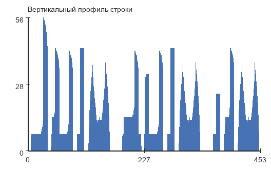

Горизонтальный профиль строки:

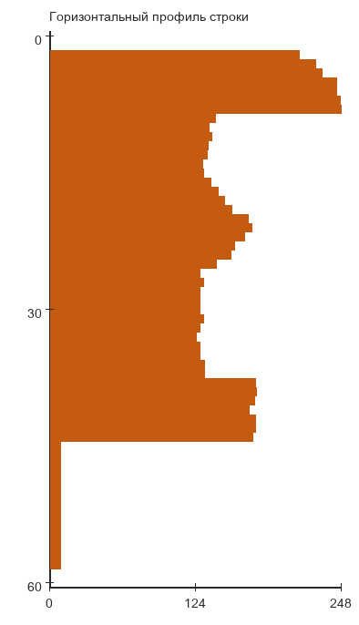

Текстовая область:

Сегментация символов:

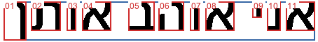

Галерея вырезанных символов:

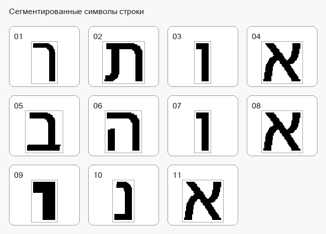

#### Координаты прямоугольников символов

Прямоугольники упорядочены слева направо, сверху вниз.

| № | `x_left` | `y_top` | `x_right` | `y_bottom` | Размер | Вес |
| --- | --- | --- | --- | --- | --- | --- |
| `01` | `5` | `2` | `37` | `58` | `33 x 57` | `644` |
| `02` | `44` | `2` | `86` | `44` | `43 x 43` | `909` |
| `03` | `95` | `2` | `108` | `44` | `14 x 43` | `386` |
| `04` | `117` | `2` | `158` | `44` | `42 x 43` | `864` |
| `05` | `183` | `2` | `220` | `44` | `38 x 43` | `675` |
| `06` | `226` | `2` | `262` | `44` | `37 x 43` | `724` |
| `07` | `271` | `2` | `284` | `44` | `14 x 43` | `386` |
| `08` | `293` | `2` | `334` | `44` | `42 x 43` | `864` |
| `09` | `360` | `2` | `373` | `25` | `14 x 24` | `234` |
| `10` | `381` | `2` | `400` | `44` | `20 x 43` | `483` |
| `11` | `408` | `2` | `449` | `44` | `42 x 43` | `864` |

Самым широким оказался символ `02` с шириной `43`, самым высоким — символ `01` с высотой `57`, а самым компактным — символ `09` с размером `14 x 24`.

### Профили символов выбранного алфавита

Сгенерированы эталонные изображения всех `27` символов иврита и построены профили `X` и `Y`. Полный набор результатов сохранён в `lab6/results/alphabet_profiles/`, а сводная таблица — в `lab6/results/alphabet_summary.csv`.

#### Общая галерея эталонов

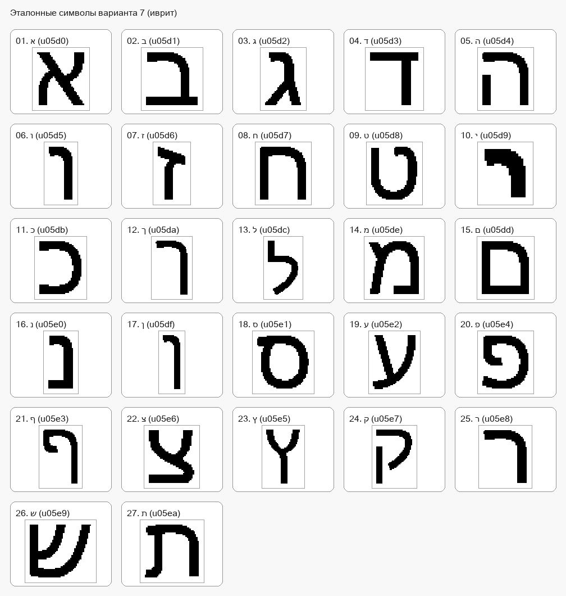

#### Примеры профилей

##### Символ `א`

Эталон:

Профиль `X`:

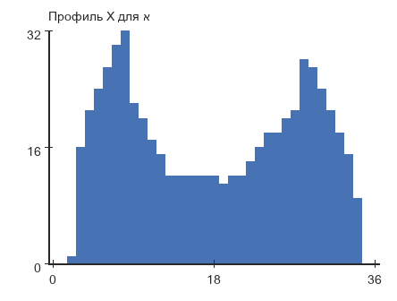

Профиль `Y`:

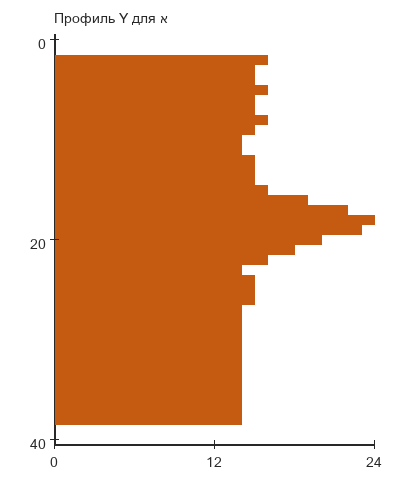

- Размер: `37 x 41`
- Вес: `581`

##### Символ `ה`

Эталон:

Профиль `X`:

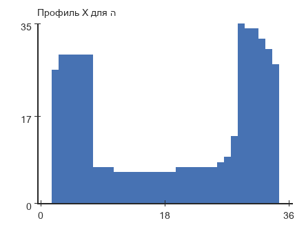

Профиль `Y`:

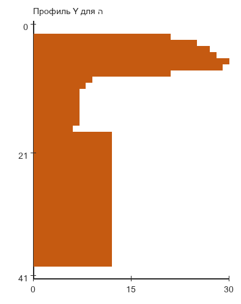

- Размер: `37 x 42`
- Вес: `510`

##### Символ `ת`

Эталон:

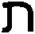

Профиль `X`:

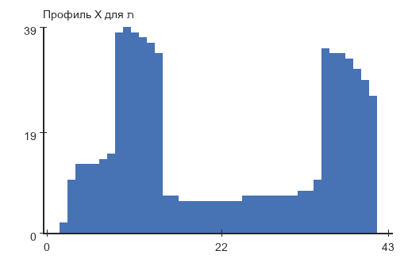

Профиль `Y`:

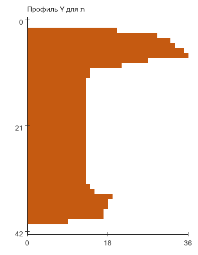

- Размер: `44 x 43`
- Вес: `661`

##### Символ `ך`

Эталон:

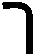

Профиль `X`:

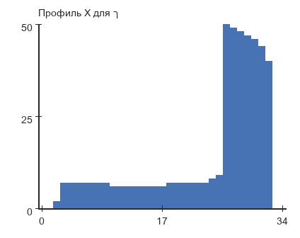

Профиль `Y`:

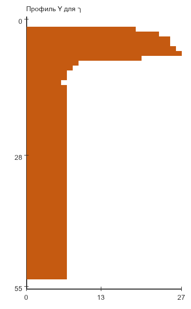

- Размер: `35 x 56`
- Вес: `482`

### Вывод

В работе выполнена сегментация строки текста на основе вертикального и горизонтального профилей.

Для исходного монохромного изображения `454 x 61` найдена текстовая область `445 x 57`, выделена одна строка и корректно сегментировано `11` символов. Для результата сохранены прямоугольники символов, вырезанные символы и сводная таблица координат.

Дополнительно построены профили `X` и `Y` для всех `27` символов выбранного алфавита. Полученные материалы сохранены в `lab6/source_symbols` и `lab6/results`.
