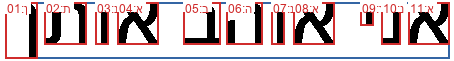
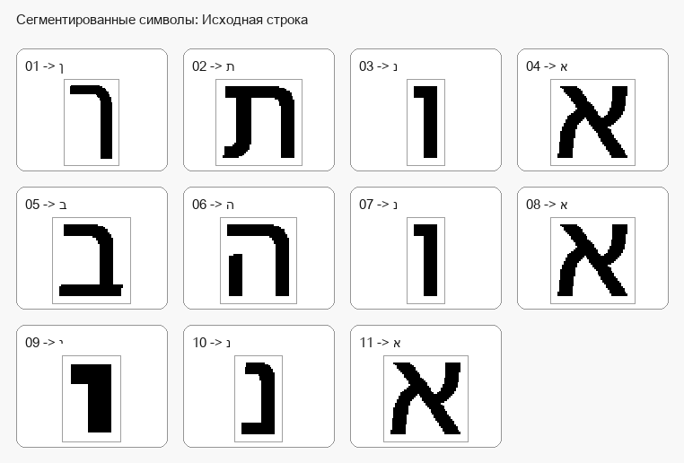
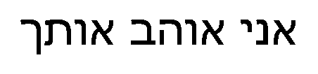
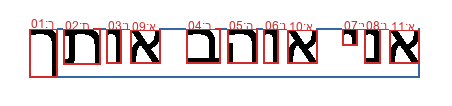
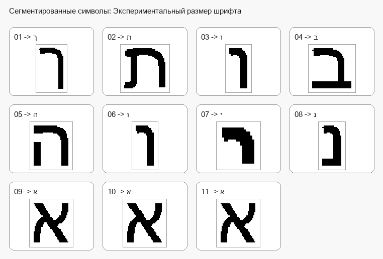

# Лабораторная работа №7

## Классификация на основе признаков, анализ профилей

### Вариант 7

Для варианта `7` по таблице задания выбран **иврит**:

`א ב ג ד ה ו ז ח ט י כ ך ל מ ם נ ן ס ע פ ף צ ץ ק ר ש ת`

В качестве распознаваемой строки используется изображение из `lab6`:

`אני אוהב אותך`

Сравнение результата с эталоном выполняется **без пробелов**, так как при сегментации выделяются только изображения символов.

### Что сделано в работе

1. Использованы эталонные признаки символов из `lab5/results/summary.csv`.
2. Использовано исходное изображение строки из `lab6/hebrew_romantic_phrase_mono.bmp`.
3. Для каждого сегментированного символа вычислены признаки:
   - масса;
   - нормированные координаты центра тяжести;
   - нормированные осевые моменты инерции.
4. Для повышения качества дополнительно вычислены нормированные отсчеты вертикального и горизонтального профилей символа.
5. Для каждого символа строки рассчитаны меры близости со всеми `27` символами алфавита.
6. Для каждого сегмента сформированы и отсортированы гипотезы распознавания.
7. Лучшие гипотезы собраны в итоговую строку.
8. Посчитаны:
   - количество ошибок;
   - доля верно распознанных символов.
9. Проведен эксперимент с тем же текстом при другом размере шрифта.

### Теория

#### 1. Признаковое пространство

Базовое признаковое описание символа:

`F = (m, xc, yc, Ix, Iy)`

где:

- `m` — масса символа;
- `xc`, `yc` — нормированные координаты центра тяжести;
- `Ix`, `Iy` — нормированные осевые моменты инерции.

Масса символа:

`m00 = Σ Σ f(x, y)`

Координаты центра тяжести:

`xc = m10 / m00`

`yc = m01 / m00`

где:

`m10 = Σ Σ x f(x, y)`

`m01 = Σ Σ y f(x, y)`

Нормированные координаты:

`xc_norm = xc / (M - 1)`

`yc_norm = yc / (N - 1)`

Осевые моменты инерции:

`Iy = Σ Σ (x - xc)^2 f(x, y)`

`Ix = Σ Σ (y - yc)^2 f(x, y)`

Нормированные осевые моменты инерции:

`Iy_norm = Iy / (M * N)`

`Ix_norm = Ix / (M * N)`

Для улучшения разделения похожих символов в признаковое описание также добавлены:

- `px1 ... px8` — нормированные отсчеты вертикального профиля;
- `py1 ... py8` — нормированные отсчеты горизонтального профиля.

Профили перед сравнением равномерно пересчитываются к `8` отсчетам, после чего участвуют в той же евклидовой мере близости как дополнительные признаки.

#### 2. Простейший алгоритм классификации символов

1. Для изображения неизвестного символа строится признаковое описание.
2. Рассчитывается мера близости неизвестного символа с каждым известным символом из базы.
3. Формируется упорядоченное множество гипотез с оценками.
4. Лучшей гипотезой выбирается символ с максимальной мерой близости.

#### 3. Мера близости

В работе используется евклидово расстояние в пространстве нормализованных признаков:

`d(A, B) = sqrt(Σ (fi(A) - fi(B))^2)`

Мера близости определяется как:

`S(A, B) = 1 / (1 + d(A, B))`

При `d = 0` получаем `S = 1`.

#### 4. Представление результатов распознавания

Для каждого сегмента строки сохраняется полный набор гипотез, отсортированный по убыванию меры близости.

В работе сформированы файлы:

- `lab7/results/original_hypotheses.csv`
- `lab7/results/original_hypotheses.txt`
- `lab7/results/experiment_hypotheses.csv`
- `lab7/results/experiment_hypotheses.txt`

#### 5. Оценка качества

Для итоговой строки вычисляются:

- число ошибок;
- доля верно распознанных символов.

Формула доли верно распознанных символов:

`Accuracy = Correct / Total`

### Выполнение

1. Из `lab5/results/summary.csv` загружены эталонные скалярные признаки всех `27` символов алфавита.
2. Из `lab6/hebrew_romantic_phrase_mono.bmp` загружено исходное бинарное изображение строки.
3. По профилям повторно выполнены:
   - выделение текстовой области;
   - выделение строки;
   - сегментация символов.
4. Каждый символ строки приведен к тому же виду, что и эталоны из `lab5`, после чего по нему вычислены скалярные признаки.
5. Для каждого символа дополнительно вычислены нормированные вертикальный и горизонтальный профили, равномерно пересчитанные к `8` отсчетам.
6. Скалярные и профильные признаки объединены в общее описание символа.
7. Для каждого сегмента строки рассчитаны расстояния до всех эталонов.
8. По полученным расстояниям построены меры близости и сформированы гипотезы.
9. Из первого столбца гипотез собрана результирующая строка.
10. Результат сравнен со строкой `אניאוהבאותך`.
11. Дополнительно сформировано новое изображение той же строки с размером шрифта `68`, после чего для него повторены сегментация и классификация.

### Сводка

| Параметр | Исходная строка | Эксперимент |
| --- | --- | --- |
| Источник | `lab6/hebrew_romantic_phrase_mono.bmp` | Сгенерированное изображение |
| Размер шрифта | Исходное изображение | `68` |
| Число эталонов | `27` | `27` |
| Число символов строки | `11` | `11` |
| Лучшая строка без пробелов | `אניאנהבאנתן` | `אאאניוהבותך` |
| Эталонная строка без пробелов | `אניאוהבאותך` | `אניאוהבאותך` |
| Ошибок | `3` | `7` |
| Верно распознано | `8` | `4` |
| Доля верных символов | `72.727273 %` | `36.363636 %` |

### Результаты распознавания исходной строки

Исходное изображение:

Сегментация и лучшие гипотезы:

Галерея сегментированных символов:

#### Лучшие и альтернативные гипотезы

| № | Ожидаемый символ | 1-я гипотеза | `S1` | 2-я гипотеза | `S2` | 3-я гипотеза | `S3` |
| --- | --- | --- | --- | --- | --- | --- | --- |
| `01` | `ך` | `ן` | `0.620706` | `ך` | `0.573509` | `ו` | `0.495648` |
| `02` | `ת` | `ת` | `0.605088` | `מ` | `0.534252` | `ס` | `0.519150` |
| `03` | `ו` | `נ` | `0.471004` | `ג` | `0.450667` | `ן` | `0.436343` |
| `04` | `א` | `א` | `0.597510` | `ש` | `0.550103` | `ס` | `0.533964` |
| `05` | `ב` | `ב` | `0.717063` | `כ` | `0.550466` | `צ` | `0.488056` |
| `06` | `ה` | `ה` | `0.623196` | `ח` | `0.616961` | `מ` | `0.595131` |
| `07` | `ו` | `נ` | `0.471004` | `ג` | `0.450667` | `ן` | `0.436343` |
| `08` | `א` | `א` | `0.597510` | `ש` | `0.550103` | `ס` | `0.533964` |
| `09` | `י` | `י` | `0.512628` | `ו` | `0.426981` | `ג` | `0.424817` |
| `10` | `נ` | `נ` | `0.704362` | `כ` | `0.521453` | `ן` | `0.512664` |
| `11` | `א` | `א` | `0.597510` | `ש` | `0.550103` | `ס` | `0.533964` |

#### Итог по исходной строке

- Лучшая строка без пробелов: `אניאנהבאנתן`
- Эталонная строка без пробелов: `אניאוהבאותך`
- Ошибок: `3`
- Доля верных символов: `72.727273 %`

Полные гипотезы сохранены в:

- `lab7/results/original_hypotheses.csv`
- `lab7/results/original_hypotheses.txt`

### Эксперимент с другим размером шрифта

Для эксперимента сгенерировано новое изображение той же строки с размером шрифта `68`.

Сгенерированная строка:

Сегментация и лучшие гипотезы:

Галерея сегментированных символов:

#### Лучшие и альтернативные гипотезы

| № | Ожидаемый символ | 1-я гипотеза | `S1` | 2-я гипотеза | `S2` | 3-я гипотеза | `S3` |
| --- | --- | --- | --- | --- | --- | --- | --- |
| `01` | `ך` | `ך` | `0.837075` | `ר` | `0.719006` | `ף` | `0.576188` |
| `02` | `ת` | `ת` | `0.840550` | `מ` | `0.594729` | `ס` | `0.582332` |
| `03` | `ו` | `ו` | `0.915889` | `ן` | `0.604767` | `י` | `0.540161` |
| `04` | `א` | `ב` | `0.893252` | `כ` | `0.576536` | `ל` | `0.510065` |
| `05` | `ב` | `ה` | `0.883659` | `ח` | `0.714209` | `ט` | `0.586860` |
| `06` | `ה` | `ו` | `0.915889` | `ן` | `0.604767` | `י` | `0.540161` |
| `07` | `ו` | `י` | `0.905513` | `ו` | `0.509015` | `ז` | `0.445232` |
| `08` | `א` | `נ` | `0.727356` | `ג` | `0.541769` | `כ` | `0.526150` |
| `09` | `י` | `א` | `0.844465` | `ע` | `0.610962` | `צ` | `0.549130` |
| `10` | `נ` | `א` | `0.844465` | `ע` | `0.610962` | `צ` | `0.549130` |
| `11` | `א` | `א` | `0.844465` | `ע` | `0.610962` | `צ` | `0.549130` |

#### Итог по эксперименту

- Лучшая строка без пробелов: `אאאניוהבותך`
- Эталонная строка без пробелов: `אניאוהבאותך`
- Ошибок: `7`
- Доля верных символов: `36.363636 %`

Полные гипотезы сохранены в:

- `lab7/results/experiment_hypotheses.csv`
- `lab7/results/experiment_hypotheses.txt`

### Вывод

В лабораторной работе выполнена классификация символов строки на основе массы, координат центра тяжести, осевых моментов инерции и нормированных отсчетов вертикального и горизонтального профилей с использованием евклидова расстояния в пространстве нормализованных признаков.

Для исходной строки из `lab6` сегментировано `11` символов, из которых верно распознано `8`, что соответствует точности `72.727273 %`. Для экспериментальной строки с размером шрифта `68` также получено `11` сегментов, из которых верно распознано `4`, что соответствует точности `36.363636 %`.

Добавление профильных признаков заметно повысило качество распознавания исходной строки, так как позволило лучше различать символы с близкими скалярными характеристиками. При этом для строки другого размера шрифта распознавание остается менее устойчивым, что видно по количеству ошибок и по близости оценок первых гипотез.
