# Лабораторная работа №8

## Текстурный анализ и контрастирование изображений

### Вариант 7

По таблице вариантов для варианта `7` требуется:

- матрица `GLCM`;
- параметры `d = 1`, `phi = {45, 135, 225, 315}`;
- признаки `CON` и `LUN`;
- метод преобразования яркости: выравнивание гистограммы.

В данной работе выполнено именно это задание. Практическая часть полностью соответствует условию `lab_08_texture_analysis_and_contrast_enhancement.md`.

## Цель работы

1. Построить матрицы совместной встречаемости уровней серого `GLCM` для нескольких изображений.
2. Рассчитать текстурные признаки `CON` и `LUN` до и после преобразования яркости.
3. Выполнить контрастирование методом эквализации гистограммы.
4. Сравнить визуально и численно исходные и контрастированные изображения.

## Теоретические сведения

### 1. Матрица `GLCM`

Матрица совместной встречаемости уровней серого `GLCM` показывает, как часто на изображении встречаются пары пикселей с яркостями `i` и `j`, если второй пиксель расположен относительно первого на фиксированном расстоянии `d` и под фиксированным углом `phi`.

Для варианта `7` использованы:

- расстояние `d = 1`;
- направления `45`, `135`, `225`, `315` градусов.

Если обозначить нормированную матрицу как `P(i, j)`, то используемые признаки вычисляются так.

Контраст:

`CON = ΣΣ (i - j)^2 * P(i, j)`

Этот признак возрастает, когда у соседних пикселей чаще встречаются заметные перепады яркости.

Локальная однородность:

`LUN = ΣΣ P(i, j) / (1 + (i - j)^2)`

Этот признак тем больше, чем чаще рядом находятся пиксели с близкими уровнями яркости.

### 2. Контрастирование 

Для цветных изображений отдельно подчёркивается:

- нельзя эквализовать каналы `RGB` по отдельности;
- лучше перейти в пространство, где яркость отделена от цветности;
- преобразование следует выполнять только над яркостным каналом.

Поэтому в работе используется цветовая модель `HSL`:

- `H` хранит тон;
- `S` хранит насыщенность;
- `L` хранит яркость.

Эквализация гистограммы выполняется только для канала `L`.

Если `n_k` — число пикселей уровня `k`, `M x N` — размер изображения, `L = 256` — число уровней яркости, то:

`p_k = n_k / (M * N)`

`CDF(k) = Σ(i = 0..k) p_i`

`s_k = (L - 1) * CDF(k)`

## Исходные данные

Для демонстрации выбраны три изображения разных типов, как и рекомендуется условием:

- `01_manuscript`:
  летопись, файл `lab2/original_01.png`
- `02_rally`:
  Subaru, файл `lab1/src.jpg`
- `03_football`:
  Палмер, файл `lab4/palmer.png`

Такой набор удобен тем, что позволяет сравнить поведение метода на:

- документном изображении с мелкими деталями текста;
- природной фотографии со смешанной текстурой;
- спортивной фотографии с выраженными областями света, тени и мелких фактур.

## Реализация

Алгоритм обработки каждого изображения состоит из следующих шагов.

1. Загружается цветное изображение `RGB`.
2. Изображение переводится в пространство `HSL`.
3. Извлекается канал яркости `L`.
4. По исходному `L` строятся:
   - полутоновое изображение;
   - гистограмма яркости;
   - матрица `GLCM`;
   - признаки `CON` и `LUN`.
5. К каналу `L` применяется эквализация гистограммы.
6. Новый канал `L` объединяется с исходными `H` и `S`, после чего формируется контрастированное цветное изображение.
7. Для контрастированного изображения снова строятся:
   - полутоновое изображение;
   - гистограмма яркости;
   - матрица `GLCM`;
   - признаки `CON` и `LUN`.
8. Матрицы `GLCM` сохраняются как изображения в градациях серого.
9. Для улучшения видимости матриц применяется логарифмическое нормирование:

`V = log(1 + GLCM) / log(1 + max(GLCM))`

10. Для каждого изображения собирается итоговая панель со всеми результатами.
11. Численные результаты записываются в `lab8/results/summary.csv`.

## Результаты вычислений

### Численные результаты

Летопись:

- `CON`: `41.900267 -> 417.735041`
- изменение `CON`: `+375.834774`
- `LUN`: `0.222767 -> 0.163753`
- изменение `LUN`: `-0.059014`

Subaru:

- `CON`: `168.695130 -> 244.063897`
- изменение `CON`: `+75.368767`
- `LUN`: `0.381048 -> 0.371725`
- изменение `LUN`: `-0.009323`

Палмер:

- `CON`: `209.361624 -> 514.459225`
- изменение `CON`: `+305.097601`
- `LUN`: `0.214777 -> 0.187403`
- изменение `LUN`: `-0.027374`

### Общие наблюдения

По всем трём изображениям наблюдается одинаковая тенденция:

- `CON` увеличивается после эквализации;
- `LUN` уменьшается после эквализации.

Это полностью согласуется со смыслом признаков:

- после выравнивания гистограммы усиливаются перепады яркости соседних пикселей;
- локальная однородность текстуры при этом уменьшается.

## Визуальные результаты

### 1. Летопись

Исходное и контрастированное цветные изображения:

До обработки:

После обработки:

Полутоновые изображения до и после эквализации:

До обработки:

После обработки:

Гистограммы яркости:

До обработки:

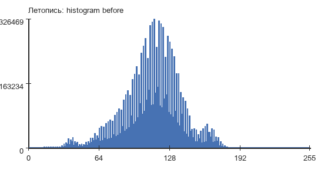

После обработки:

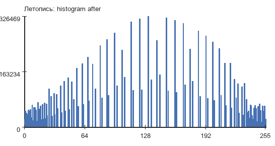

Матрицы `GLCM`:

До обработки:

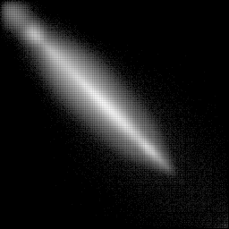

После обработки:

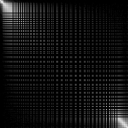

Анализ результата:

- исходная гистограмма сосредоточена в сравнительно узком диапазоне;
- после эквализации диапазон яркостей используется заметно шире;
- текст и фактура бумаги становятся более выраженными;
- матрица `GLCM` после преобразования становится более распределённой по уровням яркости;
- именно для этого изображения наблюдается самый сильный относительный рост контраста.

### 2. Subaru

Исходное и контрастированное цветные изображения:

До обработки:

После обработки:

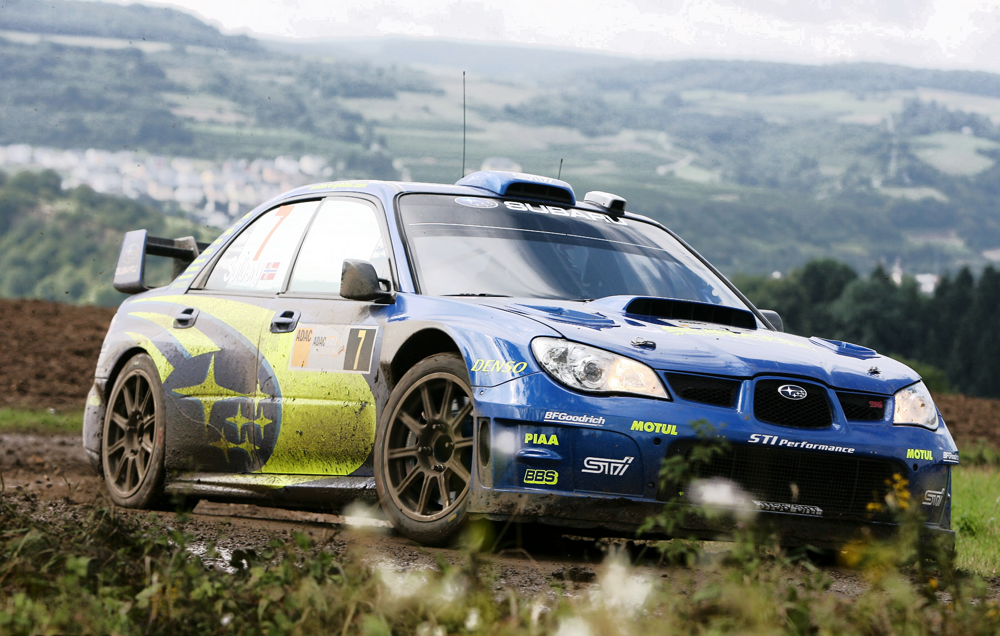

Полутоновые изображения до и после эквализации:

До обработки:

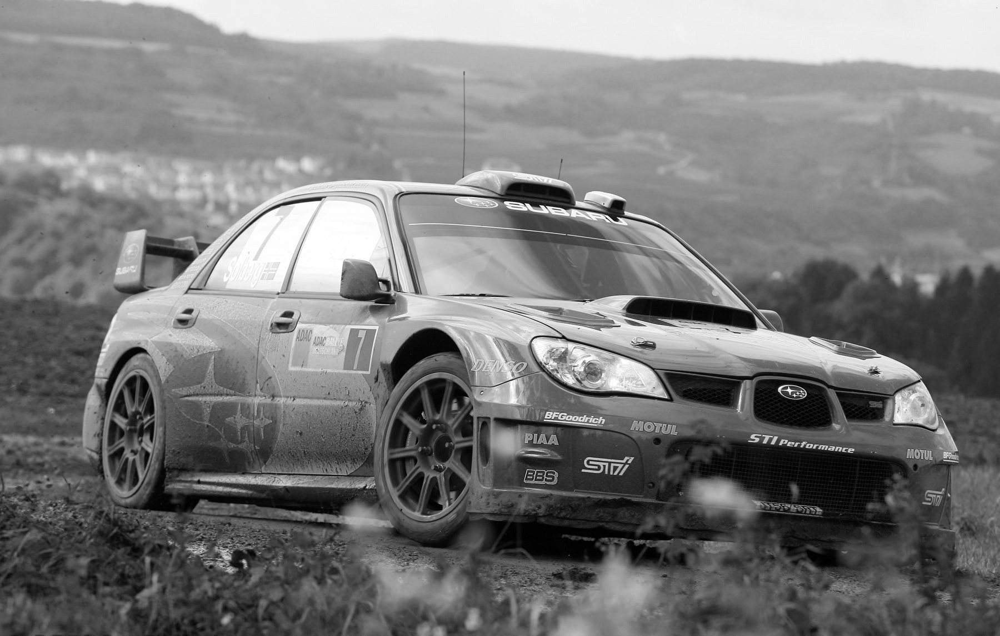

После обработки:

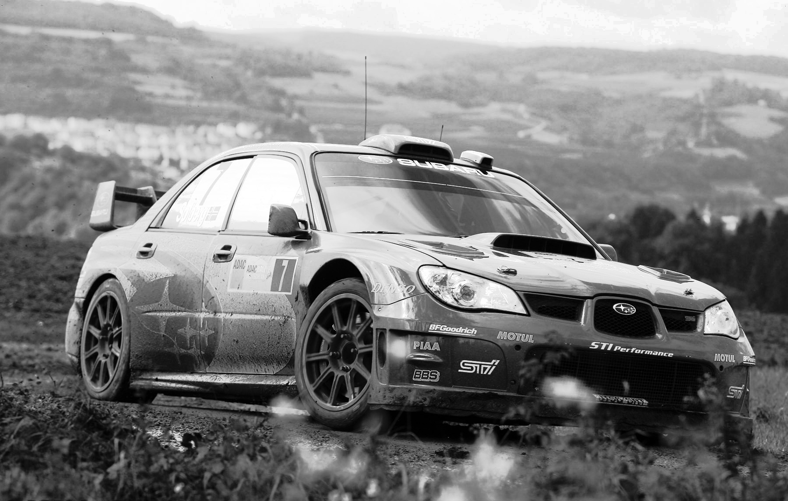

Гистограммы яркости:

До обработки:

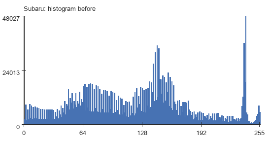

После обработки:

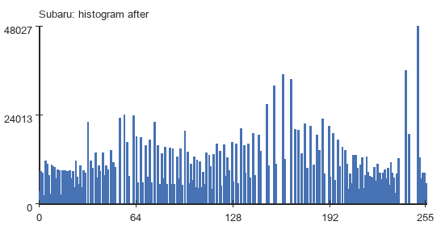

Матрицы `GLCM`:

До обработки:

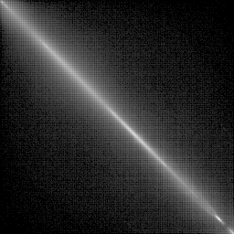

После обработки:

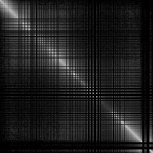

Анализ результата:

- исходное изображение уже обладает неплохим диапазоном яркостей;
- эквализация усиливает различие между кузовом, фоном и передним планом;
- изменение `CON` есть, но оно заметно мягче, чем у рукописного документа;
- `LUN` уменьшается незначительно, что соответствует умеренному усилению локальных перепадов.

### 3. Палмер

Исходное и контрастированное цветные изображения:

До обработки:

После обработки:

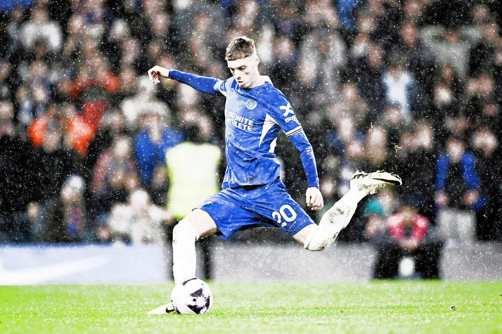

Полутоновые изображения до и после эквализации:

До обработки:

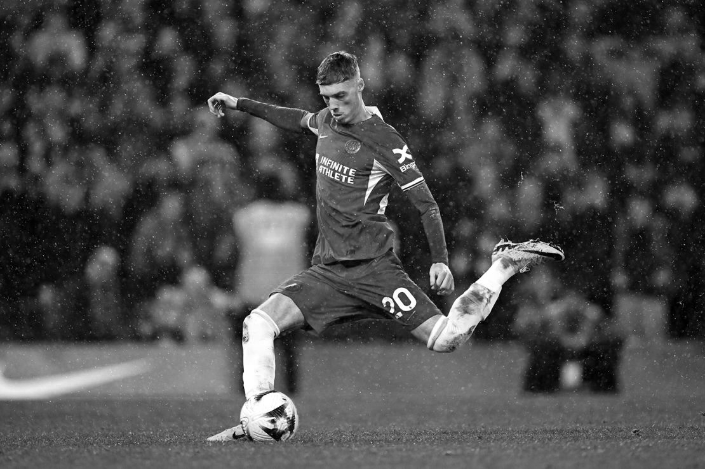

После обработки:

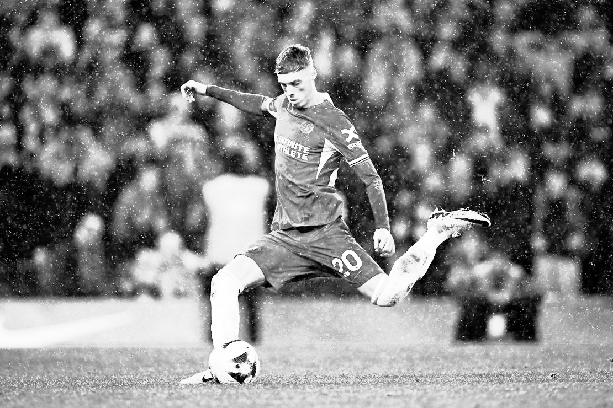

Гистограммы яркости:

До обработки:

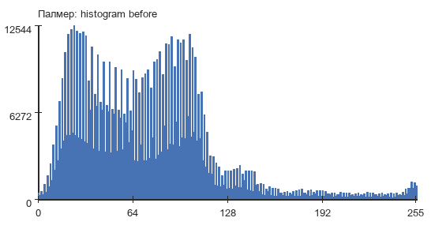

После обработки:

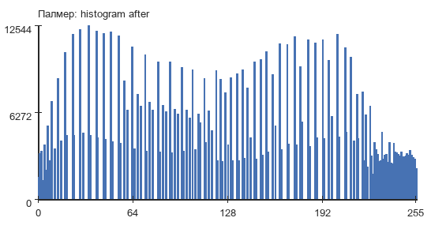

Матрицы `GLCM`:

До обработки:

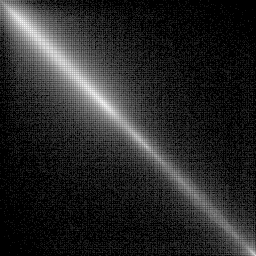

После обработки:

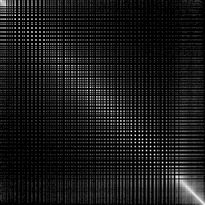

Анализ результата:

- после эквализации усиливаются детали формы, травы и зрительского фона;
- светлые области становятся ярче, тёмные фактуры читаются отчётливее;
- `CON` возрастает очень заметно, так как изображение содержит много локальных границ и мелких деталей;
- `LUN` снижается, что указывает на уменьшение локальной однородности после усиления контраста.

## Вывод

Результаты показывают, что после эквализации гистограммы у всех изображений возрастает текстурный контраст `CON` и уменьшается локальная однородность `LUN`. Наиболее сильный эффект наблюдается на рукописном документе и фотографии футболиста, где присутствуют выраженные локальные детали и неоднородности яркости.
