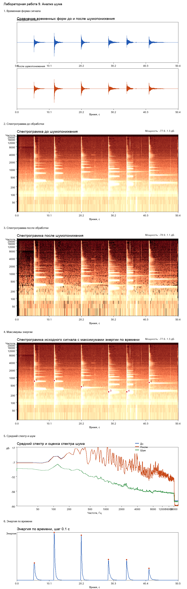
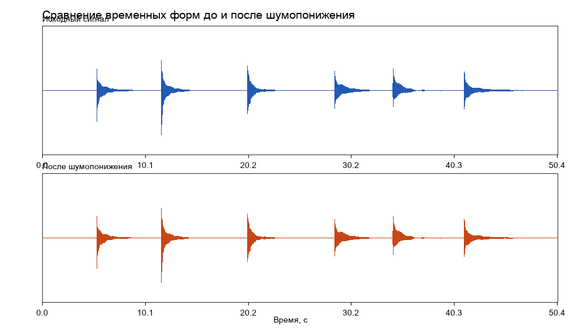
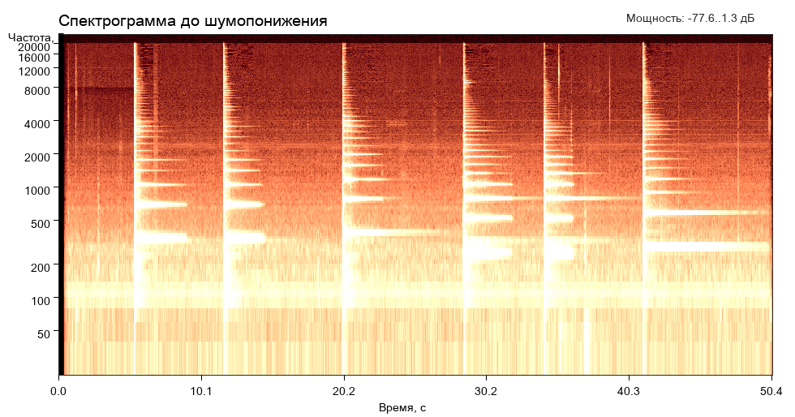
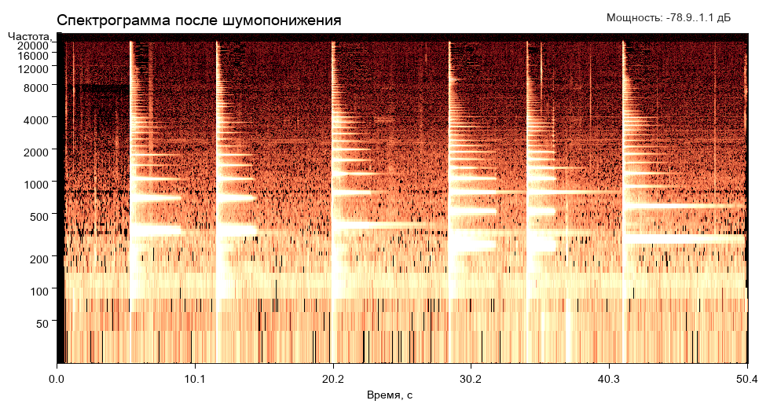
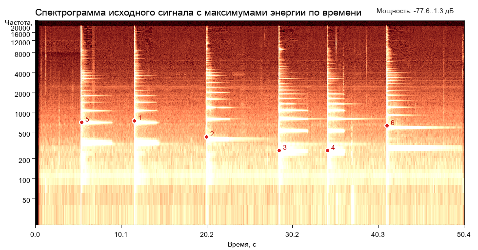
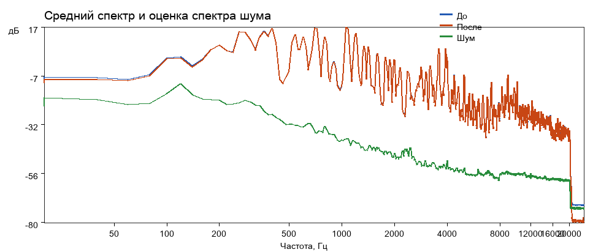
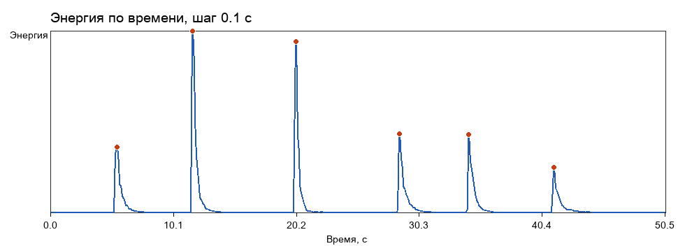

# Лабораторная работа №9

## Анализ шума в аудиосигнале

## Цель работы

1. Построить спектрограмму записи музыкального инструмента.
2. Оценить уровень шума по малоэнергетическим участкам сигнала.
3. Выполнить шумопонижение методом спектрального вычитания.
4. Сравнить сигнал и спектрограммы до и после обработки.
5. Найти моменты наибольшей энергии при шагах `Δt = 0.1 с` и `Δf = 40 Гц`.

## Исходные данные

В работе используется файл:

- `lab9/guitar.wav` — запись гитары.

Параметры записи:

| Параметр | Значение |
| --- | --- |
| Формат | `WAV` |
| Число каналов | `1` |
| Разрядность | `16` бит |
| Частота дискретизации | `48000` Гц |
| Число отсчётов | `2419200` |
| Длительность | `50.4` с |

## Теоретические сведения

### 1. Спектрограмма и `STFT`

Спектрограмма определяется как квадрат модуля оконного преобразования Фурье:

`spectrogram{x[n]} ≡ X(m, ω)^2`

Само оконное преобразование Фурье:

`STFT{x[n]}(m, ω) = X(m, ω) = Σ x[n] * w[n - m] * e^(-jωn)`

Сигнал делится на короткие окна, для каждого окна считается локальный спектр, а потом эти локальные спектры раскладываются по времени.

### 2. Окно Ханна

`w(n) = 0.5 - 0.5 cos(2πn / (N - 1))`

В работе взято:

- длина окна `N = 2400` отсчётов, то есть `50 мс`;
- шаг между окнами `600` отсчётов, то есть `12.5 мс`;
- перекрытие `75 %`.

Принцип выбора был такой:

- окно Ханна, длина окна порядка `50 мс`, перекрытие `75 %`;
- у файла `guitar.wav` частота дискретизации `Fs = 48000 Гц`;
- поэтому длина окна берётся как `N = 0.05 * Fs = 2400`;
- шаг при перекрытии `75 %` равен `25 %` длины окна, то есть `H = 0.25 * N = 600`.

Частотный шаг самой `STFT`:

`Δf_STFT = Fs / N = 48000 / 2400 = 20 Гц`

Но в условии для поиска максимумов энергии требуется `Δf = 40`–`50 Гц`, поэтому на этапе поиска максимумов соседние частотные бины объединяются попарно и получается сетка по `40 Гц`.

### 3. Отношение сигнал/шум

`SNR` определяется как отношение мощности полезного сигнала к мощности шума.

Так как мощность пропорциональна квадрату амплитуды, для оценки по `RMS` используется запись:

`SNR = 20 log10(A_signal / A_noise)`

Здесь это именно оценка, а не истинный `SNR`, потому что чистого эталонного сигнала без шума у нас нет.

### 4. Спектральное вычитание

Метод спектрального вычитания:

`Y[f, t] = max{X[f, t] - kW[f, t], 0}`

где:

- `X[f, t]` — амплитудный спектр исходного сигнала;
- `W[f, t]` — оценка спектра шума;
- `Y[f, t]` — спектр после вычитания;
- `k` — коэффициент подавления.

Фазовый спектр очищенного сигнала берётся равным фазовому спектру зашумлённого сигнала.

`k = 1.0`

То есть вычитается именно оценка шума без дополнительного завышения порога.

### 5. Автоматическая оценка шума

Будем оценивать шум автоматически по участкам минимальной энергии:

- для каждого окна `STFT` считается `RMS`;
- кадры ранжируются по этой энергии;
- шумом считаются `10 %` кадров с минимальным `RMS`;
- спектр шума берётся как средний амплитудный спектр по этим тихим кадрам.

## Численные результаты

### Основные параметры обработки

| Параметр | Значение |
| --- | --- |
| Размер окна `STFT` | `2400` отсчётов |
| Длительность окна | `0.0500` с |
| Шаг окна | `600` отсчётов |
| Шаг по времени `STFT` | `0.0125` с |
| Частотный шаг `STFT` | `20` Гц |
| Тихих кадров для оценки шума | `431` |
| Всего кадров | `4033` |
| Коэффициент подавления `k` | `1.0` |

### Оценка уровня шума

| Показатель | До | После |
| --- | --- | --- |
| `RMS` на тихих участках | `0.001081` | `0.000829` |
| `RMS` на активных участках | `0.073173` | `0.073082` |
| Оценка `SNR`, дБ | `36.612270` | `38.900965` |

Что видно по этим числам:

- амплитуда шумового фона на тихих участках уменьшилась примерно на `23.3 %`;
- по мощности шум на тихих участках уменьшился примерно на `41.2 %`;
- полезная амплитуда на активных участках почти не изменилась: снижение всего около `0.12 %`;
- оценка `SNR` выросла на `2.29 дБ`.

Это значит, что шумопонижение получилось умеренным: фон заметно ниже, а атаки и основная форма гитарных нот почти не пострадали.

### Моменты наибольшей энергии

Ниже приведены `6` самых сильных временных максимумов энергии. Для каждого момента дополнительно указана доминирующая полоса `40 Гц`, внутри которой энергия в этот момент была максимальной.

| № | Центр по времени, с | Суммарная энергия | Доминирующая полоса, Гц | Энергия доминирующей полосы |
| --- | --- | --- | --- | --- |
| `1` | `11.65` | `216836.732330` | `720..760` | `34153.551118` |
| `2` | `20.15` | `204458.246035` | `400..440` | `79541.584780` |
| `3` | `28.65` | `93504.355196` | `240..280` | `17781.832266` |
| `4` | `34.35` | `93124.427034` | `240..280` | `16823.539722` |
| `5` | `5.45` | `77941.414979` | `680..720` | `17712.582714` |
| `6` | `41.35` | `53931.345068` | `600..640` | `15317.200084` |

- самые сильные атаки приходятся примерно на `5.45`, `11.65`, `20.15`, `28.65`, `34.35` и `41.35` секунды.

Самый мощный временной максимум находится около `11.65 с`.

## Визуальные результаты

### Итоговая панель

### Временная форма сигнала

По временной форме видно, что главные всплески атак после шумопонижения сохранились почти без изменений. Фон стал ниже, но сами удары по струнам не срезались.

### Спектрограммы до и после обработки

До шумопонижения:

После шумопонижения:

Что изменилось:

- в паузах и между атаками фон стал темнее;
- основные гармонические полосы гитары сохранились;
- спектр теперь показывается без скрытого обрезания до `8 кГц`: на изображении остаётся весь доступный диапазон частот записи;
- в тихих областях после обработки всё ещё заметна зернистость.

### Моменты максимальной энергии

Красными маркерами отмечены не отдельные частотные пики, а найденные **временные моменты** наибольшей энергии. Точка поставлена на доминирующей полосе внутри каждого такого момента, чтобы было видно, где именно в спектре лежит главный вклад.

### Средний спектр и оценка шума

Зелёная кривая это оценка спектра шума. Она лежит заметно ниже среднего спектра полезного сигнала. После шумопонижения средний спектр на сильных гармониках почти совпадает с исходным, значит полезная структура сигнала в целом сохранена.

### Энергия по времени

На графике хорошо видны отдельные атаки нот. Самая сильная атака в записи приходится примерно на `11.65 с`, а следующая по мощности — на `20.15 с`.

## Вывод

В работе выполнен анализ шумовой составляющей аудиосигнала гитары: построена спектрограмма по `STFT`, шум автоматически оценён по самым тихим кадрам, затем выполнено спектральное вычитание с сохранением исходной фазы и восстановлением сигнала.

